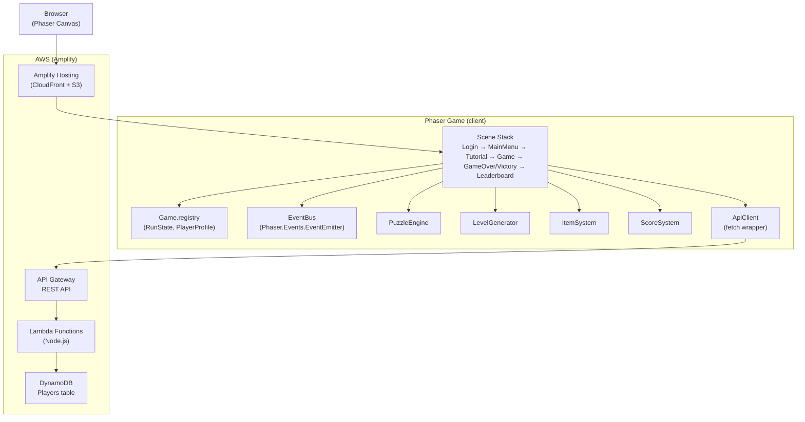
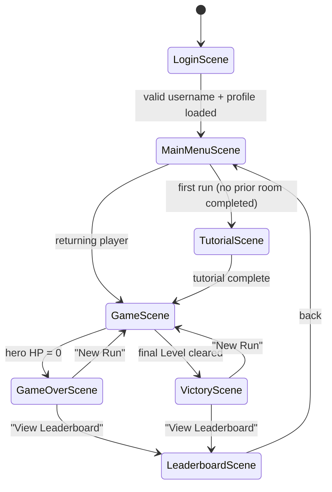
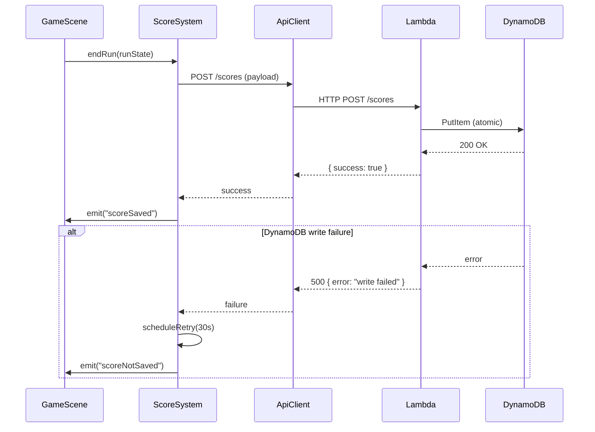

# Design Document — Cloud Quest: DevOps Dungeon

## Overview

Cloud Quest: DevOps Dungeon is a browser-based roguelike game where players defeat "production bugs" by solving programming and DevOps puzzles in real time. This document defines the technical architecture, component breakdown, data models, and testing strategy for the MVP built for Hackathon 2026.

**Technology stack:**
- **Game engine:** Phaser.js 3 (TypeScript)
- **Build tool:** Vite + `phaser/template-vite-ts` (official Phaser template — hot reload, optimized bundles, tree-shaking)
- **Hosting:** AWS Amplify (static hosting + REST API via API Gateway + Lambda)
- **Database:** AWS DynamoDB (single-table design with GSI for leaderboard queries)
- **Language:** TypeScript (strict mode)
- **Testing:** Vitest + fast-check (property-based testing)

### Key Design Decisions

| Decision | Choice | Rationale |
|---|---|---|
| Build tool | Vite | Official Phaser template, fast HMR, ES module output, Amplify-compatible `dist/` |
| Scene communication | Phaser Registry + EventEmitter | Avoid global singletons; scenes read/write through the shared Game Registry |
| Backend | API Gateway → Lambda → DynamoDB | Serverless, no server management, fits Amplify Gen 1 REST API pattern |
| DynamoDB design | Single-table with GSI | `username` as PK supports profile lookups; GSI on `score` (desc) enables leaderboard scans |
| State persistence | In-memory `RunState` object | All run data lives in memory; only final score is persisted to DynamoDB |
| Canvas scaling | Phaser `ScaleManager` `FIT` mode | Proportional scale-down without scrollbars, meets Requirement 6.7 |

---

## Architecture

### High-Level Diagram



### Scene Lifecycle



### Request Flow — Score Submission



---

## Components and Interfaces

### Scene Classes

Each scene extends `Phaser.Scene` and follows the standard lifecycle (`init → preload → create → update`). Scenes communicate through the `game.registry` (persistent key-value store) and a shared `EventBus` singleton.

```typescript
// src/scenes/LoginScene.ts
class LoginScene extends Phaser.Scene {
  create(): void;
  private onSubmit(username: string): void;
  private showError(message: string): void;
}

// src/scenes/MainMenuScene.ts
class MainMenuScene extends Phaser.Scene {
  create(): void;
  private startRun(): void;
}

// src/scenes/TutorialScene.ts
class TutorialScene extends Phaser.Scene {
  create(): void;
  private onComplete(): void;
}

// src/scenes/GameScene.ts
class GameScene extends Phaser.Scene {
  private runState: RunState;
  create(): void;
  update(time: number, delta: number): void;
  private enterRoom(room: Room): void;
  private onPuzzleSubmit(answer: string): void;
  private onTimerExpire(): void;
  private onHeroDeath(): void;
}

// src/scenes/GameOverScene.ts
class GameOverScene extends Phaser.Scene {
  init(data: GameOverData): void;
  create(): void;
}

// src/scenes/VictoryScene.ts
class VictoryScene extends Phaser.Scene {
  init(data: VictoryData): void;
  create(): void;
}

// src/scenes/LeaderboardScene.ts
class LeaderboardScene extends Phaser.Scene {
  create(): void;
  private loadLeaderboard(): Promise<void>;
  private renderEntries(entries: LeaderboardEntry[]): void;
}
```

### PuzzleEngine

Responsible for puzzle selection, answer evaluation, hint management, and timer configuration.

```typescript
interface Puzzle {
  id: string;
  category: PuzzleCategory;       // 'syntax' | 'logic' | 'devops' | 'memory'
  question: string;
  correctAnswer: string;
  hints: [string, ...string[]];   // 1–3 hints, min length enforced by type
  difficulty: number;             // 1–3
}

type PuzzleCategory = 'syntax' | 'logic' | 'devops' | 'memory';

class PuzzleEngine {
  private pool: Map<PuzzleCategory, Puzzle[]>;
  private usedIds: Set<string>;

  /** Draw one puzzle matching bug category; returns null if pool exhausted */
  draw(category: PuzzleCategory): Puzzle | null;

  /** Evaluate answer; returns true if correct */
  evaluate(puzzle: Puzzle, answer: string): boolean;

  /** Returns the hint at index (0-based); undefined if out of range */
  getHint(puzzle: Puzzle, index: number): string | undefined;

  /** Timer duration in seconds depending on boss flag */
  getTimerDuration(isBoss: boolean): 60 | 90;

  /** Compute damage from remaining seconds */
  computeDamage(remainingSeconds: number): number; // clamp(remainingSeconds * 2, 10, 120)

  /** Reset used puzzle tracking (called on new Run) */
  reset(): void;
}
```

### LevelGenerator

Generates procedural level sequences for each run.

```typescript
interface Room {
  id: string;
  type: 'combat' | 'rest' | 'item';
  connections: string[];          // IDs of connected rooms
  bugId?: string;                 // present only in combat rooms
  isEntrance: boolean;
  isExit: boolean;
}

interface Level {
  levelNumber: number;
  rooms: Room[];
  bugBaseHP: number;              // = BASE_HP * (1 + 0.10 * (levelNumber - 1))
  puzzleStepCount: number;        // = BASE_STEPS + floor((levelNumber - 1) / 2)
}

interface LevelSequence {
  levels: Level[];                // length in [5, 10]
  seed: number;
}

class LevelGenerator {
  /** Generate a full run sequence (5–10 levels) */
  generate(seed?: number): LevelSequence;

  /** Generate a single level at position N */
  private generateLevel(n: number, seed: number): Level;

  /** Guarantee path from entrance to exit via BFS */
  private hasNavigablePath(rooms: Room[]): boolean;

  /** Fallback level for index n (pre-defined layout) */
  getFallbackLevel(n: number): Level;
}
```

### ItemSystem

Manages item pool, selection, application, and stacking rules.

```typescript
type ItemType =
  | 'Timer_Extension'
  | 'HP_Recovery'
  | 'Hint_Revealer'
  | 'Score_Multiplier'
  | 'Bug_Weakener'
  | 'Second_Chance';

interface Item {
  id: string;
  type: ItemType;
  description: string;
}

interface HeroItemSlots {
  active: Item[];   // max 3 items
}

class ItemSystem {
  private pool: Item[];
  private awarded: Set<string>;

  /** Draw 2 random items without replacement; returns up to 2 */
  drawSelection(): [Item, Item] | [Item];

  /** Apply item effect to run state; removes item from pool */
  applyItem(item: Item, runState: RunState): void;

  /** Check if hero can accept a new item (< 3 active) */
  canAccept(slots: HeroItemSlots): boolean;

  /** Reset pool for new Run */
  reset(): void;
}
```

### ScoreSystem

Handles score calculation, speed bonus, and persistence.

```typescript
interface ScoreEvent {
  levelNumber: number;
  remainingSeconds: number;
  bugDifficulty: number;
  hasScoreMultiplier: boolean;
}

class ScoreSystem {
  /** Calculate score increment for a solved puzzle */
  calculateIncrement(event: ScoreEvent): number;
  // base = 100 * levelNumber
  // + 50 if remainingSeconds > 30 (Speed_Bonus)
  // × 2 if hasScoreMultiplier

  /** Persist run result to backend; returns true on success */
  async submitScore(result: RunResult): Promise<boolean>;

  /** Schedule one retry after delay ms */
  private scheduleRetry(result: RunResult, delayMs: number): void;
}
```

### ApiClient

Thin fetch wrapper over the Amplify REST API endpoints.

```typescript
interface ApiClient {
  /** POST /scores — submit run result */
  submitScore(payload: ScorePayload): Promise<void>;

  /** GET /scores — fetch top leaderboard entries */
  getLeaderboard(): Promise<LeaderboardEntry[]>;

  /** POST /players — create or retrieve player profile */
  getOrCreatePlayer(username: string): Promise<PlayerProfile>;
}
```

### EventBus

A module-level Phaser `EventEmitter` used for decoupled cross-scene events.

```typescript
// src/lib/EventBus.ts
import Phaser from 'phaser';
export const EventBus = new Phaser.Events.EventEmitter();

// Event name constants
export const EVENTS = {
  PUZZLE_SUBMITTED: 'puzzle:submitted',
  TIMER_EXPIRED:    'timer:expired',
  BUG_DEFEATED:     'bug:defeated',
  HERO_HP_CHANGED:  'hero:hpChanged',
  RUN_ENDED:        'run:ended',
  SCORE_SAVED:      'score:saved',
  SCORE_NOT_SAVED:  'score:notSaved',
} as const;
```

---

## Data Models

### RunState (in-memory)

```typescript
interface RunState {
  sessionId: string;
  username: string;
  currentScore: number;
  currentLevel: number;
  highestLevelReached: number;
  heroHP: number;               // 0–100
  activeItems: Item[];          // max 3
  levelSequence: LevelSequence;
  currentRoom: Room | null;
  currentPuzzle: Puzzle | null;
  timerSeconds: number;
  hintsShown: number;
  totalPuzzlesSolved: number;
  totalBugsDefeated: number;
  scoreMultiplierRoomsRemaining: number; // 0 = inactive
}
```

### PlayerProfile (DynamoDB + memory)

```typescript
interface PlayerProfile {
  username: string;       // PK
  personalBest: number;
  updatedAt: string;      // ISO 8601 UTC
}
```

### DynamoDB Table Design

**Table: `cloud-quest-scores`**

| Attribute | Type | Role |
|---|---|---|
| `username` | String | Partition Key |
| `runId` | String | Sort Key (UUID per run) |
| `score` | Number | GSI sort key |
| `highestLevel` | Number | — |
| `timestamp` | String | ISO 8601 UTC |

**GSI: `ScoreIndex`**
- Partition key: `gameId` (constant value `"CLOUD_QUEST"` — single-game app, avoids hot partition)
- Sort key: `score` (Number, descending query)
- Projection: ALL

This design supports both access patterns:
- Look up player's personal best: `GetItem(PK=username, SK=runId)` → scan by username
- Retrieve global leaderboard: `Query(GSI, PK="CLOUD_QUEST", ScanIndexForward=false, Limit=10)`

```typescript
// Score submission payload
interface ScorePayload {
  username: string;
  score: number;
  highestLevel: number;
  timestamp: string;    // UTC ISO 8601
}

// Leaderboard entry (GET /scores response)
interface LeaderboardEntry {
  username: string;
  score: number;
  runDate: string;      // YYYY-MM-DD
}
```

### Puzzle Data (static JSON, bundled with client)

```typescript
// src/data/puzzles.ts — loaded at game start
const PUZZLE_POOL: Record<PuzzleCategory, Puzzle[]> = {
  syntax:  [...],   // ≥ 5 entries
  logic:   [...],   // ≥ 5 entries
  devops:  [...],   // ≥ 5 entries
  memory:  [...],   // ≥ 5 entries
};
```

Puzzle data is static and bundled with the game (no runtime fetch needed). This keeps latency low and avoids DynamoDB reads per puzzle.

### Item Definitions (static)

```typescript
const ITEM_DEFINITIONS: Item[] = [
  { id: 'timer-ext',      type: 'Timer_Extension',  description: 'Adds 15s to the active timer (capped at initial max).' },
  { id: 'hp-recovery',    type: 'HP_Recovery',       description: 'Restores 20 HP (max 100).' },
  { id: 'hint-revealer',  type: 'Hint_Revealer',     description: 'Auto-shows next hint on your next incorrect answer.' },
  { id: 'score-mult',     type: 'Score_Multiplier',  description: 'Doubles base score for next 3 rooms (non-stackable).' },
  { id: 'bug-weakener',   type: 'Bug_Weakener',       description: 'Reduces next bug\'s HP by 30% (rounded down).' },
  { id: 'second-chance',  type: 'Second_Chance',      description: 'Once: when HP would hit 0, set it to 1 instead.' },
];
```

---

## Correctness Properties

*A property is a characteristic or behavior that should hold true across all valid executions of a system — essentially, a formal statement about what the system should do. Properties serve as the bridge between human-readable specifications and machine-verifiable correctness guarantees.*

### Property 1: Username validation is exactly the accepted character set

*For any* string, the username validator returns valid if and only if the string consists solely of alphanumeric characters and underscores, and its length is between 3 and 20 characters (inclusive).

**Validates: Requirements 1.2, 1.3, 1.4**

---

### Property 2: Personal best display matches stored score

*For any* non-negative integer score stored in the player profile (including 0 for new players), the login screen displays exactly that value as the personal best.

**Validates: Requirements 1.7, 1.8**

---

### Property 3: Level sequence validity invariants

*For any* generated run, the level sequence satisfies: (a) length is in [5, 10], (b) every level has a room count in [3, 7], (c) every level contains at least one combat room and at least one rest room, and (d) all level layout configurations within the same run are pairwise distinct.

**Validates: Requirements 2.1, 2.2**

---

### Property 4: Difficulty scaling formula

*For any* level number N in [1, 10], the generated level assigns Bug HP equal to `BASE_HP × (1 + 0.10 × (N − 1))` and puzzle step count equal to `BASE_STEPS + floor((N − 1) / 2)`.

**Validates: Requirements 2.3**

---

### Property 5: Run-to-run level diversity

*For any* pair of consecutively generated runs for the same username, at least 50% of the corresponding level indices differ in room count or bug placement.

**Validates: Requirements 2.4**

---

### Property 6: All levels have a navigable path

*For any* generated level, there exists at least one path from the entrance room to the exit room where every room on that path is traversable without requiring combat completion from a non-combat room.

**Validates: Requirements 2.5**

---

### Property 7: Damage formula clamp

*For any* remaining timer value T in (0, 90] seconds (covering both standard and boss timers), the computed damage equals `max(10, min(120, T × 2))`.

**Validates: Requirements 3.4**

---

### Property 8: Score bonus on bug defeat

*For any* bug difficulty level D (positive integer), when the bug's HP reaches 0, the score bonus awarded equals `100 × D`.

**Validates: Requirements 3.7**

---

### Property 9: Puzzle pool integrity

*For any* puzzle in the pool, it has exactly one correct answer and its hint list contains between 1 and 3 entries, each a distinct non-empty string.

**Validates: Requirements 3.2, 3.8**

---

### Property 10: Item selection without replacement

*For any* run state, after a combat room is completed, the item selection presented contains exactly 2 distinct items, both drawn from the items not yet awarded in the current run.

**Validates: Requirements 4.1**

---

### Property 11: Item effect application and pool removal

*For any* valid item type, when the player selects it, the item's effect is applied immediately to the run state and the item is removed from the pool for the remainder of the current run.

**Validates: Requirements 4.3**

---

### Property 12: Active item cap

*For any* sequence of item acquisition events during a run, the hero's active item count never exceeds 3.

**Validates: Requirements 4.4**

---

### Property 13: Rest room HP restoration clamp

*For any* hero HP value in [0, 100], after entering a rest room, the new HP equals `min(currentHP + 25, 100)`.

**Validates: Requirements 4.6**

---

### Property 14: Score increment formula

*For any* level number L in [1, 10] and any remaining timer value T, the score increment for a correctly solved puzzle equals `(100 × L) + speedBonus`, where `speedBonus = 50` if `T > 30`, else `0`; the result is further multiplied by 2 if `Score_Multiplier` is active.

**Validates: Requirements 5.1, 5.2**

---

### Property 15: Leaderboard entry rendering

*For any* leaderboard entry with any username (of any length), score, and UTC timestamp, the rendered display truncates the username to at most 20 characters, shows the score as a numeric value, and formats the date as YYYY-MM-DD.

**Validates: Requirements 5.7**

---

### Property 16: Personal best update rule

*For any* pair of (currentBest, newScore) where both are non-negative integers, after a run ends, the stored personal best equals `max(currentBest, newScore)`.

**Validates: Requirements 5.8**

---

### Property 17: Timer color threshold

*For any* timer value T, the timer display color is red if and only if T ≤ 10 seconds.

**Validates: Requirements 6.3**

---

### Property 18: Low-health indicator threshold

*For any* hero HP value in [0, 100], the low-health indicator is visible if and only if HP < 25.

**Validates: Requirements 6.4**

---

### Property 19: End-screen content completeness

*For any* game-over state (any score, level, bugs defeated), the Game_Over screen displays all four required data fields and exactly two option buttons ("New Run" and "View Leaderboard"). Likewise, for any victory state, the Victory screen displays all required data fields and exactly two option buttons.

**Validates: Requirements 8.3, 8.4**

---

### Property 20: New Run resets run state

*For any* in-progress game state, after the player selects "New Run", the resulting state has: HP = 100, activeItems = [], score = 0, currentLevel = 1, and the LevelGenerator is invoked to produce a fresh level sequence. The username is preserved unchanged.

**Validates: Requirements 8.5, 8.6**

---

## Error Handling

### DynamoDB / Network Errors

| Scenario | Handling |
|---|---|
| Profile fetch timeout (> 3s) | Show inline error in LoginScene; keep username in input field; offer Retry button |
| Score submit failure (first attempt) | Queue single retry after 30s; show "Score queued" toast to player |
| Score submit retry failure | Show "Score not saved" message; display run summary locally regardless |
| Leaderboard fetch failure | Show "Could not load leaderboard" with a Retry button |
| DynamoDB partial write | Lambda returns HTTP 500; client treats as full failure (atomic guarantee from DynamoDB conditional writes) |

All API calls use a 5-second `AbortController` timeout. Errors propagate via rejected Promises and are caught at the `ApiClient` call site in each scene.

### Level Generation Failures

If `LevelGenerator` fails to satisfy room-type constraints after 3 attempts for a given level index, it logs the failure to console (for diagnostics) and returns `getFallbackLevel(n)` — a pre-defined, validated layout for that index.

### Input Validation

Username validation runs client-side (regex `/^[a-zA-Z0-9_]{3,20}$/`) before any DynamoDB call. This prevents unnecessary network traffic on invalid input.

### Timer Edge Cases

- `Timer_Extension` item: caps new timer at the initial maximum (60s or 90s) to prevent cheating the damage formula.
- If `timerSeconds` ever becomes negative due to race conditions, it is clamped to 0 before damage/penalty calculation.

### Item Discard Timeout

If the player does not respond to the discard prompt within 60 seconds, the selection is cancelled silently and the existing 3 items are preserved. The Phaser `TimerEvent` is used for this countdown; it is destroyed if the player responds before timeout.

---

## Testing Strategy

### Overview

The project uses a dual testing approach: **unit/property tests** (Vitest + fast-check) for pure logic, and **integration tests** (Vitest with mocked AWS SDK / Phaser) for scene flows and API interactions. Phaser rendering is not tested at the unit level; visual regression is handled manually during the Hackathon demo.

### Test Configuration

```typescript
// vitest.config.ts
import { defineConfig } from 'vitest/config';
export default defineConfig({
  test: {
    environment: 'jsdom',
    globals: true,
    include: ['src/**/*.test.ts'],
  },
});
```

### Property-Based Tests (fast-check)

Each property-based test runs a minimum of **100 iterations**. Each test is tagged with a comment referencing the design property.

```typescript
import * as fc from 'fast-check';

// Feature: cloud-quest-devops-dungeon, Property 1: username validation character set
test('Property 1: username validation — accepts exactly valid pattern', () => {
  fc.assert(fc.property(
    fc.string({ minLength: 0, maxLength: 25 }),
    (s) => {
      const result = validateUsername(s);
      const expected = /^[a-zA-Z0-9_]{3,20}$/.test(s);
      return result === expected;
    }
  ), { numRuns: 100 });
});

// Feature: cloud-quest-devops-dungeon, Property 7: damage formula clamp
test('Property 7: damage formula clamp', () => {
  fc.assert(fc.property(
    fc.integer({ min: 1, max: 90 }),
    (t) => computeDamage(t) === Math.max(10, Math.min(120, t * 2))
  ), { numRuns: 100 });
});
```

**Property tests cover:** Properties 1–20 (see Correctness Properties section above).

The property-based testing library is **[fast-check](https://github.com/dubzzz/fast-check)** — a mature TypeScript-first PBT library that integrates natively with Vitest.

### Unit / Example-Based Tests

Unit tests cover specific scenarios, edge cases, and integration points:

- LoginScene: valid/invalid username flows, DynamoDB error + retry
- GameScene: combat loop (correct answer, wrong answer, timer expiry, hero death)
- Item discard prompt (3-item cap, 60s timeout cancellation)
- Score_Multiplier + Bug_Weakener interaction order
- LevelGenerator fallback (3 failed attempts → fallback level)
- Puzzle category coverage per category (≥ 5 puzzles)
- API mock tests: score submission success/failure/retry, leaderboard retrieval

### Integration Tests

End-to-end scene flows are tested with Phaser scenes instantiated in jsdom (or headless), AWS SDK mocked via `vi.mock`:

- Full run simulation: login → game → game over → leaderboard
- DynamoDB write success/failure with HTTP 500 response
- Leaderboard retrieval with < 10 records (no empty rows)
- HTTPS redirect enforcement (tested at deployment via curl)

### Accessibility

WCAG 2.1 AA compliance for font size (≥ 14px) and contrast ratio (≥ 4.5:1 for normal text) is verified with automated contrast-check tooling during CI. Full validation requires manual testing with assistive technologies and expert accessibility review.

### Coverage Targets

| Layer | Target |
|---|---|
| Pure logic (PuzzleEngine, ScoreSystem, LevelGenerator, ItemSystem, validators) | ≥ 90% |
| Scene integration tests | Key flows covered |
| API client | All success + failure paths |
| Rendering / visual | Manual demo review |
