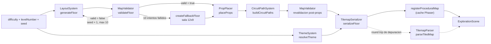
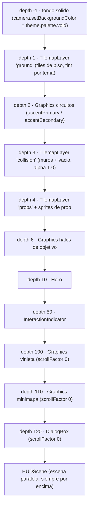
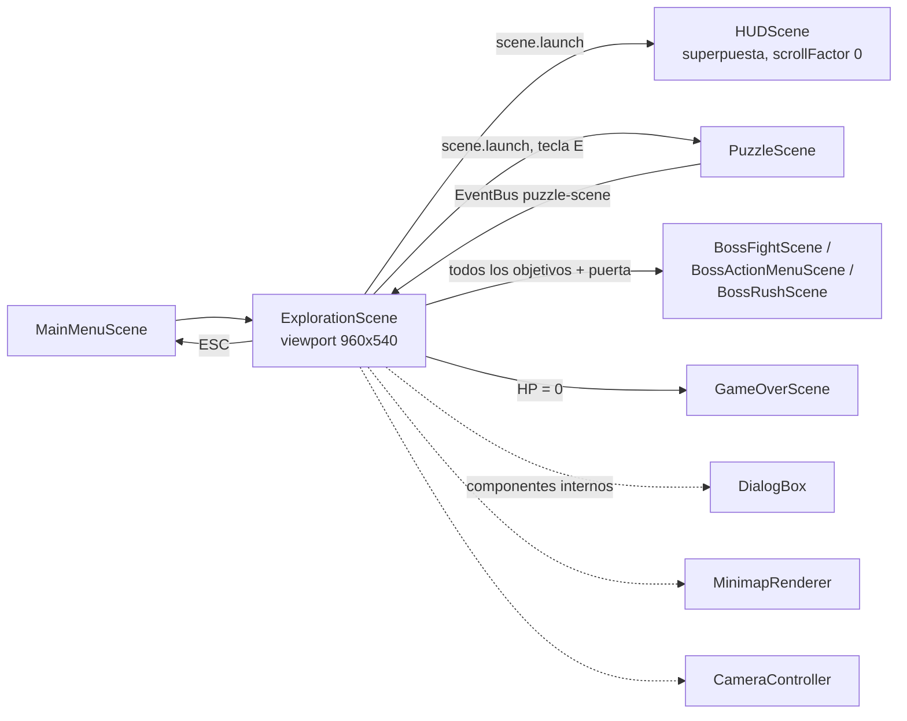
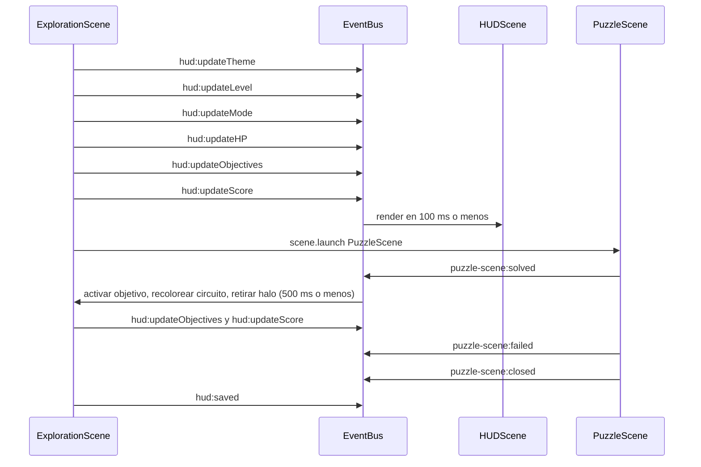

# Design Document — Dungeon Visual Overhaul

## Overview

Esta feature reemplaza la capa de generación espacial y de render de `ExplorationScene` por una cadena de sistemas puros (sin `phaser`) que producen un **Descriptor_De_Planta** validado, y una capa de presentación delgada que solo dibuja lo que el descriptor declara. El objetivo funcional es que las tres dificultades se lean como tres calabozos de datacenter distintos, con colisiones correctas y alcanzabilidad garantizada.

### Qué se reemplaza

| Artefacto actual | Estado | Motivo |
|---|---|---|
| `generateProceduralMap()` en `src/lib/ProceduralMap.ts` | **Se elimina** | Escribe `TILES.PILLAR` en la capa `collision`, usa el mismo generador 20×15 para las tres dificultades y fija el spawn en `(3,3)` sin validar |
| `registerProceduralMap()` en `src/lib/ProceduralMap.ts` | **Se conserva** (firma intacta) | Sigue siendo el único punto de registro en `scene.cache.tilemap` |
| `ExplorationScene.generateDecoration()` + `getScenarioPalette()` | **Se eliminan** | Dibujan rectángulos de 2–6 px con `Graphics` en lugar de props |
| `ExplorationScene.createLighting()` | **Se reescribe** sobre `LightingSystem` | Hoy la viñeta se dibuja con `vw = 780 / 2.5`, atada al viewport recortado |
| `ExplorationScene.createMinimap()` / `updateMinimap()` | **Se reescriben** sobre `MinimapProjection` + `MinimapRenderer` | Hoy la escala (`mmSize / mapW`) puede caer por debajo de 1 px por tile y el minimapa está arriba-izquierda |
| `ExplorationScene.extractCollisionData()` | **Se elimina** | El arreglo de colisión pasa a venir del descriptor validado (Requerimiento 3.12) |
| Bloque de cámara `setViewport(0, 0, 780, 540)` + `setZoom(2.5)` | **Se reescribe** sobre `CameraFraming` + `CameraController` | Viewport completo 960×540 con HUD superpuesto |
| `collisionLayer.setAlpha(0.5)` | **Se elimina** | Origen directo del contraste nulo (Requerimiento 1.7) |
| `HUDScene` con `PANEL_WIDTH = 180` / `PANEL_X` | **Se reescribe** | Panel lateral → bloques superpuestos en esquinas |

### Qué se conserva sin cambios

- **Flujo de escenas**: `LoginScene → MainMenuScene → (TutorialScene) → ExplorationScene ⇄ PuzzleScene → BossFightScene/BossActionMenuScene/BossRushScene → VictoryScene/GameOverScene`. Las cuatro transiciones de `ExplorationScene` (terminal → `PuzzleScene`, puerta con todos los objetivos → escena de jefe, HP 0 → `GameOverScene`, ESC → `MainMenuScene`) quedan intactas.
- **Sistemas de dominio**: `FragmentSystem`, `PuzzleEngine`, `InteractableSystem`, `DifficultySystem`, `SaveSystem`, `StorySystem`, `MovementSystem`, `FeedbackSystem`, `ScoreSystem`.
- **Contrato de eventos existente**: los eventos `hud:updateHearts`, `hud:updateFragments`, `hud:updateScore`, `hud:updateLevel`, `hud:updateMode` y `hud:saved` siguen emitiéndose durante toda la migración; el HUD nuevo agrega eventos, no rompe los viejos.
- **`Hero`** y su contrato `setCollisionCheck((tileX, tileY) => boolean)`, que sigue leyendo `isTileWalkable(collision, width, x, y)`.
- **i18n**: `t()`, `setLocale()`, `onLocaleChange()` de `src/lib/i18n.ts` y la forma de `TRANSLATIONS`.
- **Fórmulas de negocio** de `.kiro/steering/tech.md`: daño, score, HP, escalado de bugs, apilamiento de ítems.
- **Resolución lógica** 960×540 con `ScaleManager` en modo FIT.

### Estrategia de migración incremental

La regla es que cada paso deje el juego jugable y la suite verde. Se logra con dos decisiones de diseño:

1. **Los sistemas puros se construyen y testean antes de conectarse.** `ThemeSystem`, `LayoutSystem`, `MapValidator`, `PropPlacer`, `CircuitPathSystem`, `LightingSystem`, `TilemapSerializer`, `TilemapParser`, `MinimapProjection` y `CameraFraming` no importan `phaser` y no tienen consumidores hasta que existe `MapPipeline`. Mientras no se conectan, `ExplorationScene` sigue funcionando con el código actual.
2. **Un único punto de conmutación.** `ExplorationScene.create()` obtiene el mapa desde `buildFloor()` de `src/systems/MapPipeline.ts`, que devuelve el descriptor validado y el JSON Tiled. Cuando ese punto se cambia, la escena pasa del generador viejo al nuevo en un solo commit, y el resto (interactables, puzzles, jefe, save) sigue consumiendo la capa `objects` del mismo formato Tiled que ya parsea `InteractableSystem.parseInteractables`.

El detalle por capas está en `## Migration and Rollout`.

---

## Architecture

### Pipeline de generación de mapa

El pipeline es una cadena de funciones puras. Ninguna etapa muta su entrada: cada una devuelve un descriptor nuevo. La única etapa con efectos es el registro en la caché de Phaser.



Notas de orden que importan:

- **`PropPlacer` corre después de `MapValidator`** porque necesita un descriptor con alcanzabilidad ya garantizada para poder descartar props que la rompan (Requerimiento 5.10).
- **`CircuitPathSystem` corre después de `PropPlacer`** porque los circuitos deben trazarse sobre el arreglo de colisión final.
- **`ThemeSystem` no participa en la topología.** Alimenta únicamente índices de tile y tintes, lo que hace que `hard` y `normal` compartan planta bit a bit con la misma semilla (Requerimiento 2.4).

### Composición de capas de render

`ExplorationScene` compone las capas de mundo y de interfaz con profundidad explícita y constante; ningún objeto se dibuja sin `setDepth`.



Consecuencias del orden:

- Circuitos en `depth 2` quedan por encima del piso y por debajo de muros, props y héroe (Requerimiento 6.8).
- Props en `depth 4` quedan por encima del piso y de los circuitos, y por debajo del héroe en `depth 10` (Requerimiento 5.8).
- La viñeta y el minimapa usan `setScrollFactor(0)`, por lo que su posición en pantalla no depende del desplazamiento ni del zoom (Requerimientos 7.4, 9.2).
- El tinte ambiental **no** se dibuja como capa: se aplica como `tile.tint` sobre las capas `ground`, `collision` y `props`, y como `setTint` sobre los sprites de prop. Esto evita un `Graphics` del tamaño del mapa y excluye por construcción al HUD, al DialogBox y al minimapa (Requerimiento 7.9).

**Presupuesto de `Graphics` persistentes (Requerimiento 13.3, máximo 6):** circuitos (1), halos (2), viñeta (3), minimapa (4), marco del DialogBox (5). Queda uno libre. Los efectos de `FeedbackSystem` son transitorios y se destruyen en su `onComplete`.

### Diagrama de escenas



`DialogBox`, `MinimapRenderer` y `CameraController` son componentes de la propia `ExplorationScene`, no escenas. No se comunican por `EventBus`: la escena los invoca directamente.

### Flujo de eventos del EventBus



Eventos nuevos de esta feature:

| Evento | Payload | Emisor → Receptor |
|---|---|---|
| `hud:updateHP` | `{ current: number; max: number }` | ExplorationScene → HUDScene |
| `hud:updateObjectives` | `{ activated: number; total: number }` | ExplorationScene → HUDScene |
| `hud:updateTheme` | `{ themeId: ThemeId; uiText: number; uiBackground: number; accentPrimary: number; accentSecondary: number }` | ExplorationScene → HUDScene |

Eventos legados que se siguen emitiendo durante la migración: `hud:updateHearts`, `hud:updateFragments`, `hud:updateScore`, `hud:updateLevel`, `hud:updateMode`, `hud:saved`. `hud:updateHearts` y `hud:updateFragments` se retiran solo en el último paso del rollout, cuando ningún consumidor los escucha.

### Algoritmos

Todo el pseudocódigo asume un PRNG propio, `createPrng(seed)` en `src/lib/Prng.ts`, con la misma congruencia lineal que ya usa el proyecto (`rng = (rng * 1664525 + 1013904223) & 0x7fffffff`). **Ningún sistema puro llama a `Math.random`**; esa es la condición del determinismo por semilla.

#### 1. Generación de sala única (`beginner`)

```
funcion generateSingleRoomFloor(levelNumber, seed):
  prng = createPrng(seed XOR (levelNumber * 2654435761))
  roomW = prng.intInRange(10, 14)        # Requerimiento 2.2
  roomH = prng.intInRange(8, 11)
  width  = roomW + 2                     # 12..16
  height = roomH + 2                     # 10..13

  ground    = arreglo(width * height, VOID_TILE)
  collision = arreglo(width * height, WALL_MID)   # todo bloqueante al inicio
  para cada (r, c) con 1 <= r <= roomH y 1 <= c <= roomW:
      ground[r * width + c]    = prng.pick(theme.tiles.floor)
      collision[r * width + c] = 0                # contrato: 0 = caminable

  room = { id: 'room-0', role: 'start', row: 1, column: 1, width: roomW, height: roomH }

  interior = tiles caminables con 2 <= r <= roomH-1 y 2 <= c <= roomW-1
  spawn    = prng.pick(interior)                   # Requerimiento 2.13
  restantes = interior menos spawn, ordenados por (row, column)
  # 2 terminales + 1 puerta, separados >= 2 en Chebyshev cuando el area lo permite
  objetivos  = elegirDispersos(prng, restantes, 3, separacionMinima = 2)
  terminales = objetivos[0..1] con tipo 'terminal'
  puerta     = objetivos[2] con tipo 'door'        # Requerimiento 2.12

  retornar descriptor con rooms = [room], corridors = [], spawn, objectives
```

`elegirDispersos` recorre los candidatos en orden determinista arrancando en un índice derivado del PRNG y acepta un candidato si su Distancia_De_Chebyshev a todos los ya elegidos es ≥ `separacionMinima`; si agota candidatos, baja la separación a 1 y repite. Termina siempre porque el interior de una sala 10×8 tiene al menos 48 tiles.

#### 2. Generación de planta multi-sala (`normal` y `hard`)

```
constantes: GRID_COLS = 2, GRID_ROWS = 3, CELL_W = 12, CELL_H = 11
            width  = GRID_COLS * CELL_W + 2 = 26     # dentro de 20..40
            height = GRID_ROWS * CELL_H + 2 = 35     # dentro de 20..40

funcion generateMultiRoomFloor(levelNumber, seed, terminalCount):
  prng = createPrng(seed XOR (levelNumber * 2654435761))
  roomCount = prng.intInRange(4, 6)                  # Requerimiento 2.3

  celdas   = las 6 celdas de la grilla, ordenadas por (filaCelda, columnaCelda)
  elegidas = prng.sample(celdas, roomCount)
  garantizar que elegidas contenga la celda de menor filaCelda y la de mayor filaCelda
  ordenar elegidas por (filaCelda, columnaCelda)

  rooms = []
  para i, celda en elegidas:
      roomW = prng.intInRange(5, 10)
      roomH = prng.intInRange(4, 8)
      # margen >= 1 dentro de la celda => separacion >= 2 entre salas (Req 2.10, 2.11)
      offR = prng.intInRange(1, CELL_H - roomH - 1)
      offC = prng.intInRange(1, CELL_W - roomW - 1)
      rooms.push({ id: 'room-' + i, role: 'rest', row: celda.row0 + offR,
                   column: celda.col0 + offC, width: roomW, height: roomH })

  rooms[0].role                = 'start'             # sala superior
  rooms[rooms.length - 1].role = 'boss'              # sala inferior (Req 2.5)

  ground    = arreglo(width * height, VOID_TILE)
  collision = arreglo(width * height, WALL_MID)
  para cada room: tallar(room)                       # collision = 0, ground = piso

  corridors = []
  para i desde 0 hasta rooms.length - 2:
      a = centro(rooms[i]); b = centro(rooms[i + 1])
      # corredor en L: primero vertical, luego horizontal (orden fijo => determinista)
      tiles = segmentoVertical(a, b) ++ segmentoHorizontal(a, b)
      corridorWidth = prng.intInRange(1, 2)
      tallarCorredor(tiles, corridorWidth)
      corridors.push({ id: 'cor-' + i, fromRoomId: rooms[i].id,
                       toRoomId: rooms[i+1].id, tiles, width: corridorWidth })

  # el perimetro exterior nunca se talla: filas 0 y height-1, columnas 0 y width-1
  # quedan en WALL_MID por construccion (Req 3.5)

  spawn      = tile interior determinista de la sala 'start'
  puerta     = tile interior determinista de la sala 'boss'              # Req 2.12
  candidatos = tiles interiores de salas != 'boss', excluyendo spawn y puerta
  terminales = elegirDispersos(prng.fork('objectives'), candidatos,
                               terminalCount, separacionMinima = 3)

  retornar descriptor
```

`terminalCount` viene de la dificultad: `beginner` 2, `normal` 3, `hard` 5 (Requerimientos 2.6, 2.7, 2.8). Como el conteo de terminales se aplica **después** de fijar salas, corredores y dimensiones, y usa un flujo de PRNG derivado (`prng.fork('objectives')`), `hard` y `normal` con la misma semilla producen la misma topología y difieren solo en la cantidad de terminales (Requerimiento 2.4).

#### 3. BFS de alcanzabilidad (`MapValidator`)

```
funcion reachableFrom(collision, width, height, startRow, startColumn):
  si startRow o startColumn fuera de limites: retornar conjunto vacio
  si collision[startRow * width + startColumn] != 0: retornar conjunto vacio
  visitados = { startRow * width + startColumn }
  cola = [ (startRow, startColumn) ]
  DIRS = [ (-1,0), (1,0), (0,-1), (0,1) ]          # solo cardinales, sin diagonales
  mientras cola no vacia:
      (r, c) = cola.shift()
      para (dr, dc) en DIRS:
          nr = r + dr; nc = c + dc
          si nr, nc dentro de limites y collision[nr * width + nc] == 0
             y (nr * width + nc) no visitado:
                 visitados.add(nr * width + nc)
                 cola.push((nr, nc))
  retornar visitados
```

`validateFloor` corre este BFS **una vez** y luego consulta pertenencia por objetivo, en lugar de un BFS por objetivo. Costo O(ancho × alto): 910 nodos en el mapa más grande.

Las comprobaciones de los Requerimientos 3.2 a 3.5 se ejecutan todas, para poder devolver una entrada de violación por incumplimiento en lugar de cortar en el primero:

```
funcion validateFloor(floor):
  v = []
  si floor.collision.length != floor.width * floor.height:
      v.push({ check: 'collision-length', ... })
  si floor.width fuera de [10, 40] o floor.height fuera de [10, 40]:
      v.push({ check: 'dimensions', ... })
  si spawn fuera de limites:
      v.push({ check: 'spawn-in-bounds', ... })
  si v no vacio: retornar { valid: false, violations: v }     # Req 3.14

  si collision[indice(spawn)] != 0: v.push({ check: 'spawn-walkable', ...spawn })
  para cada tile del perimetro con collision == 0:
      v.push({ check: 'perimeter-blocking', row, column })
  alcanzables = reachableFrom(collision, width, height, spawn.row, spawn.column)
  para cada objetivo o:
      si collision[indice(o.tile)] != 0:
          v.push({ check: 'objective-walkable', ...o.tile })
      si indice(o.tile) no en alcanzables:
          v.push({ check: 'objective-reachable', ...o.tile })
  retornar { valid: v.length == 0, violations: v }             # Req 3.13
```

#### 4. Bucle de reintentos y fallback

```
funcion generateFloor({ difficulty, levelNumber, seed }):
  d = normalizarDificultad(difficulty)        # no reconocida => 'normal' (Req 2.14)
  n = clamp(levelNumber, 1, 5)
  para intento desde 0 hasta 9:               # 10 intentos contando el inicial
      s = (seed + intento) mod 2147483648
      floor = (d == 'beginner')
              ? generateSingleRoomFloor(n, s)
              : generateMultiRoomFloor(n, s, terminalCountFor(d))
      resultado = validateFloor(floor)
      si resultado.valid:
          retornar { floor, validation: resultado,
                     attempts: intento + 1, usedFallback: false }
  fallback = createFallbackFloor(n)           # sala 12x9, sin props bloqueantes
  retornar { floor: fallback, validation: validateFloor(fallback),
             attempts: 10, usedFallback: true }
```

`createFallbackFloor` es determinista y no usa PRNG: sala caminable de 12 × 9 con perímetro bloqueante (mapa 14 × 11), spawn en `(2, 2)`, terminales en `(2, 5)` y `(2, 8)`, puerta en `(9, 11)`, `props = []`, y sus circuitos calculados por `CircuitPathSystem`. Su `ValidationResult` tiene `violations = []` por construcción, y un test lo verifica (Requerimiento 3.8).

#### 5. Colocación determinista de props

```
funcion placeProps({ floor, seed, difficulty }):
  prng = createPrng(seed XOR 0x5bf03635)
  collision = copia(floor.collision)
  props = []; descartados = 0; ocupados = conjunto vacio

  excluidos = tiles de: spawn, objetivos, vecinos cardinales de objetivos,
              circuitPaths declarados, corredores                       # Req 5.4

  para cada room en floor.rooms ordenadas por (row, column):
      caminables = tiles caminables de room, ordenados por (row, column)
      P = cantidad de caminables adyacentes en cardinal a un tile bloqueante
      minN = floor(0.12 * P); maxN = floor(0.25 * P)
      si maxN == 0: continuar                                           # Req 5.2
      N = prng.intInRange(minN, maxN)
      candidatos = prng.shuffle(caminables menos excluidos menos ocupados)
      colocados = 0
      para tile en candidatos:
          si colocados == N o props.length == 40: cortar                # Req 5.11
          esBorde = tile adyacente en cardinal a un tile bloqueante
          tipo = elegirTipo(prng, esBorde, difficulty)   # rack solo si esBorde (Req 5.3)
          bloqueante = isBlockingProp(tipo)
          si bloqueante:
              collision[indice(tile)] = tileIndexDe(tipo)               # Req 3.9
              si NO allObjectivesReachable(collision, floor):
                  collision[indice(tile)] = 0                           # Req 5.10
                  descartados += 1
                  continuar
          # no bloqueante: collision conserva 0                         # Req 3.10, 5.9
          props.push({ id: 'prop-' + props.length, type: tipo, tile,
                       blocking: bloqueante, tileIndex: tileIndexDe(tipo) })
          ocupados.add(indice(tile)); colocados += 1

  retornar { props, collision, propsLayer: capaDe(props), discarded: descartados }
```

`elegirTipo` sortea sobre la tabla de pesos fija de `## Theming` y, cuando `difficulty === 'hard'`, sustituye `energy-container` por `corrupt-container` conservando tile y marca de bloqueo (Requerimiento 5.7). `allObjectivesReachable` reutiliza `reachableFrom`: como máximo 40 props bloqueantes × 910 nodos ≈ 36 000 visitas, holgadamente dentro del presupuesto de 500 ms (Requerimiento 13.12).

#### 6. Construcción de circuit paths

```
funcion buildCircuitPaths(floor):
  paths = []; violations = []
  para cada objetivo o en floor.objectives (en orden del descriptor):
      si o.tile == floor.spawn:
          paths.push({ objectiveId: o.id, tiles: [floor.spawn] })       # Req 6.7
          continuar
      ruta = shortestPath(floor.collision, floor.width, floor.height,
                          floor.spawn, o.tile)
      si ruta == null:
          violations.push({ check: 'objective-reachable', ...o.tile })  # Req 6.6
          continuar
      # L = longitud minima; la cota del Req 6.4 es floor(1.5 * L)
      assert ruta.length <= maxCircuitLength(ruta.length)
      paths.push({ objectiveId: o.id, tiles: ruta })
  retornar { paths, violations }
```

`shortestPath` es un BFS con predecesores y orden de exploración fijo `[arriba, izquierda, derecha, abajo]`, lo que hace la ruta única y determinista para un descriptor dado (Requerimiento 6.5). Como se usa la ruta mínima, la cota `longitud ≤ floor(1.5 × L)` se cumple con `longitud = L`, dejando margen si más adelante se agrega un desvío estético. El BFS garantiza además que cada tile es caminable, que los consecutivos son adyacentes en cardinal y que no hay repetidos (Requerimientos 6.2, 6.3).

**Nota de orden:** `CircuitPathSystem` corre después de `PropPlacer`, por lo que las rutas nunca atraviesan un prop bloqueante. La exclusión inversa del Requerimiento 5.4 (props no sobre tiles de circuito) se satisface porque `PropPlacer` recibe los `circuitPaths` presentes en el descriptor: en la primera pasada de un piso nuevo esa lista está vacía, y en cualquier repintado posterior (por ejemplo al reactivar un piso guardado) los props ya están fijados en el descriptor y no se recalculan.

#### 7. Proyección del minimapa

```
funcion computeMinimapScale(width, height):
  retornar max(1, floor(120 / max(width, height)))                      # Req 9.9

funcion projectMinimap(input):
  si width fuera de [1, 40] o height fuera de [1, 40]:
      retornar { scale: 0, cells: [], widthPx: 0, heightPx: 0,
                 originX: 8, originY: 532 }                             # Req 9.12
  escala = computeMinimapScale(width, height)
  # recorte: nunca dibujar mas alla de 120 px por lado
  columnasVisibles = min(width,  floor(120 / escala))
  filasVisibles    = min(height, floor(120 / escala))
  widthPx  = columnasVisibles * escala
  heightPx = filasVisibles * escala
  originX = 8                                                           # margen izq
  originY = 540 - 8 - heightPx                                          # margen inf
  celdas = []
  para cada indice i en discovered:
      (r, c) = (floor(i / width), i mod width)
      si r >= filasVisibles o c >= columnasVisibles: continuar          # Req 9.3
      kind = collision[i] == 0 ? 'walkable' : 'blocking'
      celdas.push({ x: originX + c * escala, y: originY + r * escala,
                    size: escala, kind })
  agregar celda 'hero' si el tile del heroe entra en el recorte
  objetivo = selectActiveObjective(objectives, heroTile, discovered, width)
  si objetivo != null: agregar celda 'objective'                         # Req 9.8, 9.11
  retornar { scale: escala, originX, originY, widthPx, heightPx, cells: celdas }
```

`selectActiveObjective` elige el objetivo no activado y descubierto de menor Distancia_De_Manhattan al héroe, desempatando por menor fila y luego por menor columna (Requerimiento 9.7). Con `width = 26`, `height = 35`: `escala = max(1, floor(120/35)) = 3`, `filasVisibles = min(35, 40) = 35`, `heightPx = 105`, `widthPx = 78`. Todas las celdas caen dentro del recuadro de 120 × 120 con origen `(8, 427)`.

#### 8. Encuadre de cámara

```
funcion computeCameraFrame(difficulty, mapWidthTiles, mapHeightTiles):
  viewport = { x: 0, y: 0, width: 960, height: 540 }                    # Req 11.3
  si dimensiones invalidas o dificultad no reconocida:
      retornar { zoom: 2.5, viewport, bounds: viewport, followLerp: 0.10,
                 centerX: false, centerY: false, isFallback: true }      # Req 11.8
  mapPxW = mapWidthTiles * 16
  mapPxH = mapHeightTiles * 16
  zoom = (difficulty == 'beginner')
         ? 3.0                                                          # Req 11.1
         : redondear2(clamp(960 / mapPxW, 1.5, 2.5))                     # Req 11.2
  bounds = { x: -16, y: -16, width: mapPxW + 32, height: mapPxH + 32 }   # Req 11.4
  centerX = (mapPxW * zoom) <= 960
  centerY = (mapPxH * zoom) <= 540                                       # Req 11.7
  retornar { zoom, viewport, bounds, followLerp: 0.10,
             centerX, centerY, isFallback: false }
```

`redondear2(x) = Math.round(x * 100) / 100`. El zoom queda siempre en `[1.5, 3.0]` porque `beginner` es 3.0 y las otras dos dificultades quedan acotadas por el `clamp` (Requerimiento 11.6). Con `mapWidthTiles = 26`: `960 / 416 = 2.3077 → 2.31`.

El relleno de 16 px por lado hace que los mapas de menor superficie conserven límites de área positiva y que el héroe pegado a un muro no vea el borde exacto del canvas. `CameraController` aplica `centerX` / `centerY` con `camera.centerOn` en el eje correspondiente y `startFollow(hero, true, 0.10, 0.10)` en el resto (Requerimiento 11.5).

---

## Components and Interfaces

Todos los módulos de `src/systems/` de esta sección declaran **cero importaciones de `phaser`** y se importan con el path alias `@/` (Requerimiento 13.6). Los componentes de escena sí dependen de Phaser y viven en `src/entities/`.

### `src/lib/Prng.ts` (nuevo, puro)

```typescript
export interface Prng {
  /** Siguiente flotante en [0, 1). */
  next(): number;
  /** Entero en el rango cerrado [min, max]. Si min > max, retorna min. */
  intInRange(min: number, max: number): number;
  /** Elemento de un arreglo no vacío; lanza RangeError si está vacío. */
  pick<T>(items: readonly T[]): T;
  /** Copia mezclada con Fisher-Yates. No muta la entrada. */
  shuffle<T>(items: readonly T[]): T[];
  /** Muestra sin reemplazo de tamaño count (o menos si count > items.length). */
  sample<T>(items: readonly T[], count: number): T[];
  /** Flujo derivado e independiente, identificado por etiqueta. */
  fork(label: string): Prng;
}

export function createPrng(seed: number): Prng;
```

### `src/systems/ThemeSystem.ts` (nuevo, puro)

```typescript
import type { DifficultyMode, PropType } from '@/types';

export type ThemeId = 'beginner' | 'normal' | 'hard';

export interface ThemePalette {
  floor: number;
  wall: number;
  empty: number;
  accentPrimary: number;
  accentSecondary: number;
  danger: number;
  uiText: number;
  uiBackground: number;
}

export interface ThemeTiles {
  floor: readonly [number, number, number];
  wallTop: number;
  wallMid: number;
  wallBottom: number;
  emptyTile: number;
  props: Readonly<Record<PropType, number>>;
}

export interface ThemeTints {
  /** Tinte multiplicativo aplicado a tile.tint de la capa ground. */
  floor: number;
  /** Tinte multiplicativo aplicado a los tiles de muro. */
  wall: number;
  /** Tinte de relleno (tile.tintFill = true) aplicado a los tiles de vacío. */
  empty: number;
  props: number;
}

export interface Theme {
  id: ThemeId;
  palette: ThemePalette;
  tiles: ThemeTiles;
  tints: ThemeTints;
  /** Opacidad base de los circuitos: 0.75 en beginner/normal, 0.35 en hard. */
  circuitBaseAlpha: number;
  /** true cuando se aplicó el tema por defecto ante una entrada no reconocida. */
  isFallback: boolean;
}

/** Resuelve el tema. Entradas no reconocidas → tema `normal` con isFallback = true. */
export function resolveTheme(difficulty: unknown, levelNumber: unknown): Theme;

export function getThemeIds(): readonly ThemeId[];

/** Luminancia relativa WCAG 2.1 de un color 0xRRGGBB. */
export function relativeLuminance(color: number): number;

/** Ratio de contraste WCAG 2.1: (L_mayor + 0.05) / (L_menor + 0.05). */
export function contrastRatio(a: number, b: number): number;

/** Matiz (0–360) y saturación (0–1), para verificar el criterio 1.6. */
export function hueSaturation(color: number): { hue: number; saturation: number };

/** Normaliza una entrada arbitraria a un ThemeId; null si no es válida. */
export function toThemeId(value: unknown): ThemeId | null;

/** DifficultyMode → ThemeId. Relación 1:1 en esta feature. */
export function themeIdForDifficulty(difficulty: DifficultyMode): ThemeId;
```

`resolveTheme` es total: nunca lanza. `levelNumber` fuera de `[1, 5]` se acota al límite más cercano antes de resolver (Requerimiento 1.10); el nivel no altera la paleta, solo la semilla de selección de variantes de piso, por lo que el acotamiento es observable en `tiles.floor`.

`ThemePalette.empty` y `ThemeTiles.emptyTile` se llaman así, y no `void`, porque `void` es palabra reservada de TypeScript en posición de tipo y su uso como nombre de propiedad invita a errores de lectura. El glosario del requerimiento habla de "vacío"; el mapeo es directo.

### `src/systems/LayoutSystem.ts` (nuevo, puro)

```typescript
import type { FloorDescriptor, ValidationResult } from '@/types';
import type { ThemeId } from '@/systems/ThemeSystem';

export interface LayoutRequest {
  difficulty: unknown;
  levelNumber: unknown;
  seed: number;
}

export interface LayoutOutcome {
  floor: FloorDescriptor;
  validation: ValidationResult;
  /** Intentos consumidos, contando el inicial. 1..10. */
  attempts: number;
  usedFallback: boolean;
}

export function generateFloor(request: LayoutRequest): LayoutOutcome;

export function generateSingleRoomFloor(levelNumber: number, seed: number): FloorDescriptor;

export function generateMultiRoomFloor(
  levelNumber: number,
  seed: number,
  terminalCount: number,
): FloorDescriptor;

/** Sala rectangular 12×9 determinista, sin props bloqueantes. */
export function createFallbackFloor(levelNumber: number): FloorDescriptor;

/** Objetivos de tipo terminal por tema: beginner 2, normal 3, hard 5. */
export function terminalCountFor(themeId: ThemeId): number;
```

### `src/systems/MapValidator.ts` (nuevo, puro)

```typescript
import type { FloorDescriptor, ValidationResult, Violation } from '@/types';

export const VALIDATION_CHECKS = [
  'collision-length',
  'dimensions',
  'spawn-in-bounds',
  'spawn-walkable',
  'perimeter-blocking',
  'objective-walkable',
  'objective-reachable',
] as const;

export type ValidationCheck = (typeof VALIDATION_CHECKS)[number];

export function validateFloor(floor: FloorDescriptor): ValidationResult;

/** Índices planos alcanzables desde (startRow, startColumn) por adyacencia cardinal. */
export function reachableFrom(
  collision: readonly number[],
  width: number,
  height: number,
  startRow: number,
  startColumn: number,
): Set<number>;

/** Verificación puntual usada por PropPlacer antes de confirmar un prop bloqueante. */
export function allObjectivesReachable(
  collision: readonly number[],
  floor: Pick<FloorDescriptor, 'width' | 'height' | 'spawn' | 'objectives'>,
): boolean;

export function violationsByCheck(
  result: ValidationResult,
  check: ValidationCheck,
): Violation[];
```

### `src/systems/PropPlacer.ts` (nuevo, puro)

```typescript
import type { FloorDescriptor, Prop, PropType } from '@/types';
import type { ThemeId } from '@/systems/ThemeSystem';

export interface PropPlacementRequest {
  floor: FloorDescriptor;
  seed: number;
  difficulty: ThemeId;
}

export interface PropPlacementResult {
  props: Prop[];
  /** Copia del arreglo de colisión con los props bloqueantes ya escritos. */
  collision: number[];
  /** Capa `props` del JSON Tiled: tileIndex por tile, 0 donde no hay prop. */
  propsLayer: number[];
  /** Props descartados por romper la alcanzabilidad. */
  discarded: number;
}

export const MAX_PROPS_PER_FLOOR = 40;

export const BLOCKING_PROP_TYPES: readonly PropType[];

export function isBlockingProp(type: PropType): boolean;

export function placeProps(request: PropPlacementRequest): PropPlacementResult;
```

### `src/systems/CircuitPathSystem.ts` (nuevo, puro)

```typescript
import type { CircuitPath, FloorDescriptor, TileRef, Violation } from '@/types';

export interface CircuitPathResult {
  paths: CircuitPath[];
  /** Una violación por objetivo inalcanzable; los demás circuitos se conservan. */
  violations: Violation[];
}

export function buildCircuitPaths(floor: FloorDescriptor): CircuitPathResult;

/** BFS con orden de exploración fijo [arriba, izquierda, derecha, abajo]. */
export function shortestPath(
  collision: readonly number[],
  width: number,
  height: number,
  from: TileRef,
  to: TileRef,
): TileRef[] | null;

/** Longitud máxima admitida para un circuito: floor(1.5 × longitud mínima). */
export function maxCircuitLength(shortestLength: number): number;
```

### `src/systems/LightingSystem.ts` (nuevo, puro)

```typescript
import type { DifficultyMode } from '@/types';

export interface LightingParams {
  /** Color de tinte ambiental tomado del tema. */
  tintColor: number;
  /** 0.03 – 0.12 */
  tintAlpha: number;
  /** 0.10 – 0.20 en beginner/normal; 0.25 – 0.35 en hard. */
  vignetteIntensity: number;
  /** Radio del halo por objetivo, 12 – 24 px. */
  haloRadius: number;
  /** Opacidad máxima del halo, 0.40 – 0.80. */
  haloMaxAlpha: number;
  /** Período del pulso, 1000 – 2000 ms. */
  haloPeriodMs: number;
  /** true cuando se aplicaron los parámetros por defecto. */
  isFallback: boolean;
}

/**
 * Entradas no reconocidas → tema `normal` + dificultad `normal` para AMBOS
 * parámetros, descartando el argumento reconocido (Requerimiento 7.8).
 */
export function resolveLighting(themeId: unknown, difficulty: unknown): LightingParams;

/** Acota cada valor al límite más cercano de su rango válido para la dificultad. */
export function clampLighting(
  params: LightingParams,
  difficulty: DifficultyMode,
): LightingParams;
```

### `src/systems/TilemapSerializer.ts` (nuevo, puro)

```typescript
import type { FloorDescriptor } from '@/types';

export interface TiledTileLayer {
  data: number[];
  height: number;
  id: number;
  name: 'ground' | 'props' | 'collision';
  opacity: 1;
  type: 'tilelayer';
  visible: true;
  width: number;
  x: 0;
  y: 0;
}

export interface TiledObjectEntry {
  id: number;
  name: string;
  type: string;
  x: number;
  y: number;
  width: number;
  height: number;
  properties: Array<{ name: string; type: string; value: string | number | boolean }>;
}

export interface TiledObjectLayer {
  draworder: 'topdown';
  id: number;
  name: 'objects';
  objects: TiledObjectEntry[];
  opacity: 1;
  type: 'objectgroup';
  visible: true;
  x: 0;
  y: 0;
}

export interface TiledTilesetRef {
  columns: 26;
  firstgid: 1;
  image: string;
  imageheight: number;
  imagewidth: number;
  margin: 0;
  name: 'puny-dungeon';
  spacing: 0;
  tilecount: number;
  tileheight: 16;
  tilewidth: 16;
}

export interface TiledMapJson {
  compressionlevel: -1;
  height: number;
  infinite: false;
  layers: Array<TiledTileLayer | TiledObjectLayer>;
  nextlayerid: number;
  nextobjectid: number;
  orientation: 'orthogonal';
  renderorder: 'right-down';
  tiledversion: string;
  tileheight: 16;
  tilesets: TiledTilesetRef[];
  tilewidth: 16;
  type: 'map';
  version: string;
  width: number;
}

export type SerializeErrorCode =
  | 'ground-length-mismatch'
  | 'props-length-mismatch'
  | 'collision-length-mismatch'
  | 'dimensions-out-of-range'
  | 'spawn-out-of-bounds';

export interface SerializeError {
  code: SerializeErrorCode;
  message: string;
  expected?: number;
  received?: number;
}

export type SerializeResult =
  | { ok: true; mapKey: string; json: TiledMapJson }
  | { ok: false; error: SerializeError };

export function serializeFloor(floor: FloorDescriptor): SerializeResult;
```

La capa `objects` declara el tile de spawn, cada objetivo con su tipo y coordenadas de tile, cada prop (`objectType = 'prop'`, `propType`, `blocking`) y cada `Circuit_Path` como un objeto con `objectType = 'circuit'`, `objectiveId` y `tiles` serializado como `"r,c;r,c;..."` en el orden del recorrido (Requerimientos 4.8, 4.4). El resultado es un tipo discriminado: cuando el descriptor no es serializable, el llamador recibe `{ ok: false, error }` y nunca "ninguna salida" (Requerimiento 4.5).

El orden de emisión de claves y de objetos es fijo y documentado, porque de eso depende la igualdad exacta del round-trip JSON → descriptor → JSON (Requerimiento 4.5).

### `src/systems/TilemapParser.ts` (nuevo, puro)

```typescript
import type { FloorDescriptor } from '@/types';

export type ParseErrorCode =
  | 'not-an-object'
  | 'missing-dimension'
  | 'missing-tileset'
  | 'missing-layer'
  | 'layer-size-mismatch'
  | 'missing-object-declaration';

export interface ParseError {
  code: ParseErrorCode;
  message: string;
  /** Capas o declaraciones ausentes: ['ground', 'objects'], ['spawn'], ... */
  missing: string[];
  layer?: string;
  expected?: number;
  received?: number;
}

export type ParseResult =
  | { ok: true; floor: FloorDescriptor }
  | { ok: false; error: ParseError };

export function parseTiledMap(input: unknown): ParseResult;
```

El error es siempre observable por el llamador y nunca se sustituye por valores por defecto, ni por un spawn de reserva, ni por colecciones vacías (Requerimientos 4.9, 4.11). La única ausencia tolerada es la capa `props`, que produce `props = []` y `propsLayer` de ceros (Requerimiento 4.10).

### `src/systems/MinimapProjection.ts` (nuevo, puro)

```typescript
import type { Objective, TileRef } from '@/types';

export interface MinimapProjectionInput {
  width: number;
  height: number;
  collision: readonly number[];
  /** Índices planos descubiertos. */
  discovered: ReadonlySet<number>;
  heroTile: TileRef;
  objectives: readonly Objective[];
}

export type MinimapCellKind = 'walkable' | 'blocking' | 'hero' | 'objective';

export interface MinimapCell {
  x: number;
  y: number;
  size: number;
  kind: MinimapCellKind;
}

export interface MinimapProjectionResult {
  scale: number;
  originX: number;
  originY: number;
  widthPx: number;
  heightPx: number;
  cells: MinimapCell[];
}

export const MINIMAP_MAX_PX = 120;
export const MINIMAP_MARGIN_PX = 8;
export const DISCOVERY_RADIUS = 3;

export function computeMinimapScale(width: number, height: number): number;

export function projectMinimap(input: MinimapProjectionInput): MinimapProjectionResult;

/** Índices planos con Distancia_De_Chebyshev <= radius al tile del héroe. */
export function discoveredAround(
  heroTile: TileRef,
  radius: number,
  width: number,
  height: number,
): number[];

export function selectActiveObjective(
  objectives: readonly Objective[],
  heroTile: TileRef,
  discovered: ReadonlySet<number>,
  width: number,
): Objective | null;
```

### `src/systems/CameraFraming.ts` (nuevo, puro)

```typescript
export interface CameraRect {
  x: number;
  y: number;
  width: number;
  height: number;
}

export interface CameraFrame {
  /** 1.5 – 3.0 */
  zoom: number;
  viewport: CameraRect;
  bounds: CameraRect;
  /** Factor de interpolación de seguimiento: 0.10. */
  followLerp: number;
  centerX: boolean;
  centerY: boolean;
  isFallback: boolean;
}

export const VIEWPORT_WIDTH = 960;
export const VIEWPORT_HEIGHT = 540;
export const TILE_SIZE = 16;
export const BOUNDS_PADDING_PX = 16;
export const FALLBACK_ZOOM = 2.5;
export const FOLLOW_LERP = 0.1;

export function computeCameraFrame(
  difficulty: unknown,
  mapWidthTiles: unknown,
  mapHeightTiles: unknown,
): CameraFrame;
```

### `src/systems/HudLayout.ts` (nuevo, puro)

```typescript
import type { DifficultyMode } from '@/types';

export interface HudRect {
  x: number;
  y: number;
  width: number;
  height: number;
}

/** clamp(ceil(hp / 25), 0, 4) — Requerimiento 8.5. */
export function hpSegments(hp: number): number;

/** Formato `HP_actual/100`. */
export function hpText(hp: number): string;

/** Formato `X/N` — Requerimiento 8.6. */
export function objectiveCounterText(activated: number, total: number): string;

export function intersects(a: HudRect, b: HudRect): boolean;

/** Bloques visibles por dificultad; `hard` omite el bloque de controles (Req 8.10). */
export function hudBlocksFor(difficulty: DifficultyMode): HudRect[];

export const HUD_FORBIDDEN_REGION: HudRect;
```

### `src/systems/MapPipeline.ts` (nuevo, puro) — orquestador

```typescript
import type { FloorDescriptor, ValidationResult } from '@/types';
import type { Theme } from '@/systems/ThemeSystem';
import type { TiledMapJson } from '@/systems/TilemapSerializer';

export interface FloorBuildRequest {
  difficulty: unknown;
  levelNumber: unknown;
  seed: number;
}

export interface FloorBuildResult {
  floor: FloorDescriptor;
  theme: Theme;
  validation: ValidationResult;
  mapKey: string;
  /** null si la serialización falló; `diagnostics` explica la causa. */
  json: TiledMapJson | null;
  attempts: number;
  usedFallback: boolean;
  /** Diagnóstico acumulado de toda la cadena, para la sesión. */
  diagnostics: string[];
  elapsedMs: number;
}

/**
 * Ejecuta ThemeSystem → LayoutSystem → MapValidator → PropPlacer →
 * CircuitPathSystem → MapValidator → TilemapSerializer.
 */
export function buildFloor(request: FloorBuildRequest): FloorBuildResult;
```

Es el único módulo del pipeline que `ExplorationScene` importa. Al ser puro, un test puede afirmar el presupuesto de 500 ms (Requerimiento 13.12) sin Phaser.

### `src/lib/ProceduralMap.ts` (se reduce)

```typescript
import Phaser from 'phaser';

export interface MapData {
  mapKey: string;
  json: object;
}

/** Firma sin cambios. Registra el JSON en scene.cache.tilemap si no existe. */
export function registerProceduralMap(scene: Phaser.Scene, mapData: MapData): void;
```

`generateProceduralMap`, la constante `TILES` y el bloque inline de JSON Tiled se eliminan de este archivo.

### `src/lib/SpriteGenerator.ts` (se extiende)

```typescript
import Phaser from 'phaser';
import type { PropType } from '@/types';
import type { Theme } from '@/systems/ThemeSystem';

/** Sin cambios. */
export function generateAllSprites(scene: Phaser.Scene): void;

/**
 * Texturas de reserva de 16×16 para piso, muro, vacío y los siete tipos de prop,
 * dibujadas con los colores de la paleta del tema.
 * Claves: `fb-floor-{themeId}`, `fb-wall-{themeId}`, `fb-empty-{themeId}`,
 * `fb-prop-{propType}-{themeId}`.
 */
export function generateThemeFallbackTextures(scene: Phaser.Scene, theme: Theme): void;

export function fallbackPropTextureKey(type: PropType, themeId: string): string;
```

### `src/lib/TextPager.ts` (nuevo, puro)

```typescript
/** Corta texto en páginas de hasta maxLines líneas de hasta maxLineLength caracteres. */
export function paginate(text: string, maxLineLength: number, maxLines: number): string[];
```

### `src/entities/DialogBox.ts` (nuevo, Phaser)

```typescript
import Phaser from 'phaser';
import type { Theme } from '@/systems/ThemeSystem';

export interface DialogBoxOptions {
  theme: Theme;
  /** 20 – 60 caracteres por segundo. Default 40. */
  charsPerSecond?: number;
  /** Máximo de mensajes en cola. Default 5. */
  queueLimit?: number;
}

export class DialogBox extends Phaser.GameObjects.Container {
  constructor(scene: Phaser.Scene, options: DialogBoxOptions);

  /** Encola texto ya localizado. Descarta si la cola está llena (Req 10.8). */
  show(text: string): void;
  /** Espacio, Enter o clic: completa la página, avanza, o cierra. */
  advance(): void;
  isVisible(): boolean;
  isTyping(): boolean;
  /** Páginas + mensajes pendientes. */
  pendingCount(): number;
  /** Re-renderiza el texto visible en la nueva localización sin reiniciar el tipeo. */
  refreshLocale(text: string): void;
  applyTheme(theme: Theme): void;
  destroy(fromScene?: boolean): void;
}
```

Geometría: ancho 88 % del viewport (845 px, dentro de 80–96 %), alto 24 % (130 px, dentro de 18–30 %), centrado horizontalmente, borde inferior a 16 px del borde del viewport. Prompt `> ` al inicio de la primera línea, hasta 4 líneas de 60 caracteres por página (Requerimiento 10.1). El indicador de continuar late con período 1.0 s (Requerimiento 10.11).

### `src/entities/MinimapRenderer.ts` (nuevo, Phaser)

```typescript
import Phaser from 'phaser';
import type { Objective, TileRef } from '@/types';
import type { Theme } from '@/systems/ThemeSystem';

export interface MinimapRendererConfig {
  theme: Theme;
  width: number;
  height: number;
  collision: readonly number[];
  /** true en beginner: todos los tiles descubiertos al iniciar (Req 9.10). */
  revealAll: boolean;
}

export class MinimapRenderer {
  constructor(scene: Phaser.Scene, config: MinimapRendererConfig);
  /** Marca descubiertos (Chebyshev <= 3) y redibuja. */
  update(heroTile: TileRef, objectives: readonly Objective[]): void;
  destroy(): void;
}
```

Colores de celda: caminable `theme.palette.floor`, bloqueante `theme.palette.wall` (ratio ≥ 3.0 por la tabla de `## Theming`, Requerimiento 9.5), héroe `accentPrimary`, objetivo activo `accentSecondary`.

### `src/entities/CameraController.ts` (nuevo, Phaser)

```typescript
import Phaser from 'phaser';
import type { CameraFrame } from '@/systems/CameraFraming';

export class CameraController {
  constructor(scene: Phaser.Scene);
  /** Aplica zoom, viewport, límites y centrado por eje. */
  apply(frame: CameraFrame, mapWidthTiles: number, mapHeightTiles: number): void;
  follow(target: Phaser.GameObjects.Sprite): void;
  /** Recalcula antes del primer fotograma del piso nuevo (Requerimiento 11.9). */
  reframe(frame: CameraFrame, mapWidthTiles: number, mapHeightTiles: number): void;
}
```

Los tres componentes viven en `src/entities/`, la carpeta que `.kiro/steering/structure.md` reserva para objetos de presentación con estado visual dependientes de Phaser. No se crea ninguna carpeta nueva.

### `ExplorationScene` reescrita — estructura de `create()`

```typescript
create(): void {
  const seed = this.resolveSeed();                  // del save, o Date.now() por run
  const built = buildFloor({
    difficulty: this.difficulty,
    levelNumber: this.currentLevel,
    seed,
  });
  this.floor = built.floor;
  this.theme = built.theme;
  this.collisionData = built.floor.collision;       // Req 3.12: sin recalcular

  generateAllSprites(this);
  generateThemeFallbackTextures(this, this.theme);

  if (built.json) registerProceduralMap(this, { mapKey: built.mapKey, json: built.json });
  this.buildTilemapLayers(built);                   // o renderFallbackTextures()
  this.applyThemeTints();                           // tile.tint / tintFill, sin Graphics
  this.initInteractables();                         // parseInteractables sobre 'objects'
  this.drawCircuitPaths();
  this.drawObjectiveHalos();
  this.placePropSprites();
  this.spawnHero();                                 // floor.spawn, nunca (3,3)
  this.interactionIndicator = new InteractionIndicator(this);

  this.cameraController = new CameraController(this);
  this.cameraController.apply(
    computeCameraFrame(this.difficulty, this.floor.width, this.floor.height),
    this.floor.width,
    this.floor.height,
  );
  this.cameraController.follow(this.hero);

  this.drawVignette();                              // scrollFactor 0
  this.minimap = new MinimapRenderer(this, {
    theme: this.theme,
    width: this.floor.width,
    height: this.floor.height,
    collision: this.floor.collision,
    revealAll: this.difficulty === 'beginner',
  });
  this.dialog = new DialogBox(this, { theme: this.theme });

  this.setupInput();
  this.scene.launch('HUDScene');
  this.updateHUD();
  this.showIntroStory();                            // <= 500 ms (Req 10.2)
  this.events.once('shutdown', () => this.releaseVisuals());
}
```

Se conservan textualmente de la escena actual: `initInteractables`, `handleInteraction`, `openPuzzle` con sus tres listeners de `EventBus`, `handleDoor`, `checkCompletion`, `transitionToBoss`, `onDefeat`, `tryAutoSave` y `updateHUD`.

`releaseVisuals()` destruye los cinco `Graphics`, cancela los tweens de pulso y los `TimerEvent` del DialogBox (Requerimiento 13.11).

### `HUDScene` reescrita — geometría

```typescript
const HUD_BLOCKS = {
  status:   { x: 8,   y: 8,   width: 292, height: 68 },  // HP + objetivos (Req 8.2)
  score:    { x: 660, y: 8,   width: 292, height: 52 },  // score          (Req 8.3)
  controls: { x: 660, y: 468, width: 292, height: 64 },  // controles      (Req 8.4)
  topBand:  { x: 330, y: 8,   width: 300, height: 28 },  // normal / hard  (Req 8.13)
} as const;
```

`PANEL_WIDTH` y `PANEL_X` desaparecen. Todos los objetos se crean con `setScrollFactor(0)` y `setDepth(1000)` dentro de la escena de HUD, que al lanzarse después de `ExplorationScene` queda por encima de todo lo que esta renderiza (Requerimiento 8.1). Ninguno de los cuatro bloques intersecta `HUD_FORBIDDEN_REGION = { x: 240, y: 135, width: 480, height: 270 }`, y un test puro lo verifica con `intersects()` (Requerimiento 8.14).

El estado interno del HUD distingue "sin datos aún" de "datos recibidos": mientras no llegó ningún evento muestra `100/100`, `0/N` y `0`; después de la primera recepción conserva los últimos valores recibidos y nunca vuelve a los valores por defecto (Requerimiento 8.12).

---

## Data Models

### El contrato de colisión

**Invariante central del sistema:** en el arreglo `collision`, el valor `0` significa Tile_Caminable y **cualquier** valor distinto de `0` significa Tile_Bloqueante. El arreglo es plano, indexado por `row * width + column`, y su longitud es exactamente `width * height`.

Este contrato ya está asumido por tres consumidores existentes que no se modifican:

- `isTileWalkable(collisionData, width, tileX, tileY)` en `src/lib/TilemapHelper.ts` retorna `collisionData[index] === 0`.
- `attemptMove(current, direction, collisionData, mapWidth, mapHeight)` en `src/systems/MovementSystem.ts` bloquea cuando `tileValue !== 0`.
- `hasNavigablePath(...)` en `src/lib/TilemapHelper.ts` recorre solo tiles con valor `0`.

El defecto actual es que `ProceduralMap` escribe `TILES.PILLAR` (157) en la capa `collision` **con intención decorativa**; ese 157 se interpreta correctamente como bloqueante y produce pilares capaces de encerrar objetivos. La feature no cambia el contrato: cambia quién puede escribir en el arreglo. A partir de ahora solo `LayoutSystem` y `PropPlacer` escriben valores distintos de `0`, `MapValidator` verifica el resultado, y `ExplorationScene` lo consume sin reescribir (Requerimiento 3.12).

### Tipos a agregar en `src/types/index.ts`

```typescript
// ─── Dungeon Visual Overhaul: geometría ──────────────────────────────────────

export interface TileRef {
  row: number;
  column: number;
}

export type RoomRole = 'start' | 'terminal' | 'boss' | 'rest';

export interface Room {
  id: string;
  role: RoomRole;
  /** Fila del tile superior izquierdo del área caminable. */
  row: number;
  /** Columna del tile superior izquierdo del área caminable. */
  column: number;
  /** Ancho en tiles caminables, sin contar el perímetro bloqueante. */
  width: number;
  height: number;
}

export interface Corridor {
  id: string;
  fromRoomId: string;
  toRoomId: string;
  /** Tiles caminables tallados, en orden desde fromRoomId hasta toRoomId. */
  tiles: TileRef[];
  width: 1 | 2;
}

export type ObjectiveType = 'terminal' | 'door';

export interface Objective {
  id: string;
  type: ObjectiveType;
  tile: TileRef;
  roomId: string;
  /** Solo en objetivos de tipo terminal. */
  fragmentId?: string;
  puzzleId?: string;
  activated: boolean;
}

export type PropType =
  | 'server-rack'
  | 'crt-monitor'
  | 'server-tower'
  | 'power-panel'
  | 'cable-bundle'
  | 'energy-container'
  | 'corrupt-container'
  | 'padlock';

export interface Prop {
  id: string;
  type: PropType;
  tile: TileRef;
  blocking: boolean;
  /** Índice de tile del tileset. Es el valor escrito en collision si blocking. */
  tileIndex: number;
}

export interface CircuitPath {
  objectiveId: string;
  /** Primer tile = spawn, último tile = tile del objetivo. Sin repetidos. */
  tiles: TileRef[];
}

export interface FloorDescriptor {
  levelNumber: number;
  difficulty: DifficultyMode;
  themeId: 'beginner' | 'normal' | 'hard';
  /** Semilla efectiva del intento que produjo este descriptor. */
  seed: number;
  width: number;
  height: number;
  /** Índices de tile de piso y vacío. Longitud width × height. */
  ground: number[];
  /** Índices de tile de prop, 0 donde no hay prop. Longitud width × height. */
  propsLayer: number[];
  /** 0 = caminable, distinto de 0 = bloqueante. Longitud width × height. */
  collision: number[];
  rooms: Room[];
  corridors: Corridor[];
  spawn: TileRef;
  /** Orden estable: terminales por (row, column), puerta al final. */
  objectives: Objective[];
  props: Prop[];
  circuitPaths: CircuitPath[];
}

// ─── Dungeon Visual Overhaul: validación ─────────────────────────────────────

export interface Violation {
  /** Identificador de la comprobación incumplida (ValidationCheck). */
  check: string;
  row: number;
  column: number;
  /** Contexto legible: capa afectada, cantidad esperada/recibida, id de objetivo. */
  detail?: string;
}

export interface ValidationResult {
  valid: boolean;
  violations: Violation[];
}
```

`Theme`, `ThemePalette`, `ThemeTiles`, `ThemeTints`, `LightingParams`, `MinimapProjectionResult`, `MinimapCell`, `CameraFrame` y `HudRect` se declaran en sus módulos y **no** en `src/types/index.ts`, porque son contratos de un único sistema. Los tipos de arriba sí cruzan escena, sistemas y serializador, y por eso van al barrel compartido.

### Relación con los tipos existentes

`Objective` **no** reemplaza a `Interactable`. La capa `objects` del JSON Tiled sigue declarando los objetivos como objetos Tiled con `objectType`, `fragmentId` y `puzzleId`, e `InteractableSystem.parseInteractables` sigue produciendo `Interactable[]` sin cambios. `Objective` es la representación del objetivo **en el descriptor**; `Interactable`, la representación **en la escena**. El puente es la coincidencia de `tileX` / `tileY` con `tile.column` / `tile.row`, y un test verifica que cantidad y coordenadas coincidan.

### Nota sobre el tile de acceso al jefe

El Requerimiento 3.4 exige validar el tile de la puerta de salida y el tile de acceso al jefe. En este diseño son **el mismo tile**: el objetivo de tipo `door` ubicado dentro de la sala con rol `boss` es la puerta de salida y el punto de acceso al jefe, exactamente como funciona hoy `handleDoor` → `transitionToBoss`. `MapValidator` lo comprueba una vez y reporta la violación con `check: 'objective-walkable'` y `detail: 'door/boss-access'`.

---

## Theming

### Paletas por tema

Los ocho colores exigidos por el Requerimiento 1.2, con los ratios WCAG 2.1 calculados sobre estos valores exactos:

| Tema | Piso | Muro | Vacío | Acento primario | Acento secundario | Peligro | Texto UI | Fondo UI |
|---|---|---|---|---|---|---|---|---|
| `beginner` | `#8FA37A` | `#3A4433` | `#0D110C` | `#7CE04A` | `#F0B429` | `#E2443B` | `#D8F5C0` | `#10180E` |
| `normal` | `#8AA9A2` | `#2E4744` | `#08110F` | `#2FD9C3` | `#6EE36B` | `#FF4D5A` | `#CFF7EF` | `#0A1614` |
| `hard` | `#A18274` | `#4A2A22` | `#120604` | `#FF3B30` | `#FF8C1A` | `#FF1744` | `#FFDCC8` | `#180806` |

| Tema | Piso / Muro (≥ 3.0) | Piso / Vacío (≥ 4.5) | Texto UI / Fondo UI (≥ 4.5) |
|---|---|---|---|
| `beginner` | **3.74** | **6.97** | **15.31** |
| `normal` | **3.94** | **7.54** | **16.00** |
| `hard` | **3.62** | **5.66** | **15.17** |

Matiz y saturación de los acentos (Requerimiento 1.6):

| Tema | Acento primario | Matiz | Sat. | Acento secundario | Matiz | Sat. |
|---|---|---|---|---|---|---|
| `beginner` | `#7CE04A` verde | 100.0° | 0.71 | `#F0B429` ámbar | 41.9° | 0.87 |
| `normal` | `#2FD9C3` teal | 172.3° | 0.69 | `#6EE36B` verde | 118.6° | 0.68 |
| `hard` | `#FF3B30` rojo | 3.2° | 1.00 | `#FF8C1A` naranja | 29.9° | 1.00 |

Los tres pisos difieren entre sí y los seis acentos son distintos dos a dos (Requerimiento 1.11).

**Contraste de los bloques del HUD (Requerimiento 8.11).** Cada bloque se dibuja con `uiBackground` y opacidad en `[0.45, 0.75]` sobre el mundo de juego. El ratio se verifica contra el color **compositado** `comp = α·uiBackground + (1−α)·floor`, que es el peor caso porque el piso es el fondo más claro posible. Con `α = 0.45` (el mínimo permitido) los ratios `uiText / comp` son 5.35 (`beginner`), 5.26 (`normal`) y 6.24 (`hard`). Con `α = 0.75` suben a 9.95, 10.22 y 10.93. Todos ≥ 4.5.

### Índices de tile del tileset `puny-dungeon`

El tileset es `public/assets/tilesets/puny-dungeon.png`, 416 × 320 px, 26 columnas × 20 filas de tiles de 16 × 16, con `firstgid = 1`. **Los tres temas usan exactamente el mismo conjunto de índices base**; la diferenciación cromática es 100 % tinte (Requerimiento 12.4), por lo que la feature agrega cero archivos de imagen.

| Rol | Índice(s) | Cómo se tinta |
|---|---|---|
| Piso (3 variantes) | `79`, `80`, `81` | `tile.tint = tints.floor`, multiplicativo |
| Muro superior | `1` | `tile.tint = tints.wall` |
| Muro medio | `27` | `tile.tint = tints.wall` |
| Muro inferior | `53` | `tile.tint = tints.wall` |
| Vacío | `27` | `tile.tint = tints.empty` con `tile.tintFill = true` |

El vacío usa relleno (`tintFill`) en lugar de multiplicación para que el color resultante sea exactamente `palette.empty` y el ratio piso/vacío del render coincida con el declarado. Piso y muro usan tinte multiplicativo para conservar la textura del pixel-art; el valor de tinte se precompensa por canal como `tint_c = clamp(round(palette_c / mean_c × 255), 0, 255)`, donde `mean_c` es la media del canal del tile base. La garantía normativa de contraste es sobre los colores de la paleta; un test de aproximación (tolerancia ±12 por canal) documenta la desviación del render sin formar parte del contrato.

`Phaser.Tilemaps.Tile` expone `tint: number` y `tintFill: boolean`, así que el tintado por tile no requiere shaders ni capas extra.

### Props: tipos, índices y bloqueo

| Tipo | Índice base | Bloqueante | Restricción de ubicación | Peso |
|---|---|---|---|---|
| `server-rack` | `157` | **Sí** | Solo tiles adyacentes en cardinal a un muro del perímetro de la sala (Req 5.3) | 28 |
| `server-tower` | `183` | **Sí** | Cualquier tile candidato | 14 |
| `power-panel` | `184` | **Sí** | Cualquier tile candidato | 10 |
| `crt-monitor` | `133` | No | Cualquier tile candidato | 18 |
| `cable-bundle` | `108` | No | Cualquier tile candidato | 16 |
| `energy-container` | `132` | No | Cualquier tile candidato | 10 |
| `corrupt-container` | `134` | No | Sustituye a `energy-container` cuando la dificultad es `hard` (Req 5.7) | — |
| `padlock` | `131` | No | Solo tiles adyacentes al tile de la puerta | 4 |

Son ocho miembros de unión para siete tipos declarados: `corrupt-container` es la variante temática de `energy-container`, no un tipo independiente (el Requerimiento 5.1 pide al menos siete). Los índices están re-purposados del tileset y quedan fijados por un test de instantánea sobre `ThemeTiles.props`, para que un cambio accidental falle en CI en lugar de aparecer como un tile equivocado en pantalla.

`padlock` materializa el candado dorado de la referencia visual de `normal`: se coloca adyacente a la puerta, no bloquea (la puerta gestiona su propio bloqueo lógico vía `areAllFragmentInteractablesActivated`) y recibe `accentSecondary` como tinte.

### Texturas de reserva

`generateThemeFallbackTextures` produce, por tema, 3 + 7 = 10 texturas de 16 × 16 px (piso, muro, vacío y los siete tipos de prop) dibujadas con Canvas 2D usando los colores exactos de la paleta (Requerimiento 12.6). Como no hay tinte intermedio, los ratios piso/muro ≥ 3.0 y piso/vacío ≥ 4.5 se heredan directamente de la tabla de contraste (Requerimiento 12.7).

---

## Visual Fidelity Limitations

Requerimiento 12.5. Por cada referencia visual aportada al spec se enumera al menos un elemento no reproducible con `puny-dungeon.png` + `SpriteGenerator`, y la aproximación adoptada en su lugar.

### Referencia A — Sala única de `beginner` (cámara cercana, props densos, circuitos amarillos/verdes en el piso, HUD terminal, minimapa, caja de diálogo)

| Elemento no reproducible | Por qué | Aproximación adoptada |
|---|---|---|
| **Código legible en las pantallas de los monitores CRT** | El concept art muestra líneas de texto identificables dentro de la pantalla; en un tile de 16 × 16 la pantalla ocupa ~8 × 6 px, insuficiente para glifos | Textura `fb-prop-crt-monitor-*` con 3 filas de 1 px en `accentPrimary` a opacidades 1.0 / 0.7 / 0.4, que se leen como líneas de código sin serlo. El texto real solo aparece en `PuzzleScene`, que renderiza a resolución nativa |
| **Densidad de props del concept art** | La referencia sugiere 2–3 objetos por tile, superpuestos | Un prop por tile como máximo (Requerimiento 5.11) y densidad `N ∈ [floor(0.12·P), floor(0.25·P)]` concentrada en tiles adyacentes a muro, que produce la lectura de "paredes pobladas, centro transitable" |
| **Circuitos con nodos y bifurcaciones** | Los trazos del arte tienen nodos, uniones en T y grosor variable | Un trazo por objetivo, de 2–4 px, sobre la ruta mínima. Los cruces se pintan con `accentPrimary` cuando al menos un circuito conduce a un objetivo pendiente (Requerimiento 6.12), lo que sugiere un nodo sin modelarlo |

### Referencia B — Planta multi-sala de `normal` (paleta teal/verde, salas con rol, puerta con candado dorado, sala del jefe con Golden Router)

| Elemento no reproducible | Por qué | Aproximación adoptada |
|---|---|---|
| **El Golden Router radiante del jefe** | No hay sprite de router en el tileset, y el arte muestra emisión de luz propia con rayos volumétricos | La sala `boss` recibe el prop `padlock` tintado con `accentSecondary` sobre el tile de la puerta, más un halo de radio 24 px (el máximo del rango del Requerimiento 7.2) con pulso de 1.5 s. El router como objeto reconocible aparece recién en la escena de jefe, que usa `generateBossSprite` |
| **Formas de sala no rectangulares** | El arte muestra esquinas recortadas y muros diagonales | Todas las salas son rectángulos con perímetro bloqueante de 1 tile (Requerimiento 2.11). La variedad viene de las dimensiones 5–10 × 4–8 y del offset dentro de la celda, no de la forma |
| **Símbolos "?" flotantes sobre las terminales** | El arte los dibuja como elementos de UI del mundo con tipografía propia | Se reusa `InteractionIndicator`, que ya muestra `⚠` en proximidad y `E` al encarar. No se agrega glifo nuevo |

### Referencia C — `hard` / Inferno (rojo/naranja, lava, fuego, humo)

| Elemento no reproducible | Por qué | Aproximación adoptada |
|---|---|---|
| **Lava animada** | Requiere tiles de lava con ciclo de varios fotogramas y una animación declarada; el tileset tiene tiles estáticos y ninguna animación | Los tiles de vacío del tema `hard` se rellenan con `palette.empty` (`#120604`) y el tinte ambiental usa `palette.danger` con opacidad 0.12 (el máximo del rango del Requerimiento 7.1). El movimiento percibido lo aporta el pulso de los circuitos, no la lava |
| **Humo y fuego** | Exige sistemas de partículas con sprites de humo, que no existen, y los `Graphics` persistentes están limitados a 6 (Requerimiento 13.3) | Viñeta con intensidad 0.25–0.35, el rango más oscuro (Requerimiento 7.5), más opacidad base de circuito 0.35 en lugar de 0.75 (Requerimiento 6.11). El resultado es "oscuridad opresiva" en lugar de "fuego" |
| **Sprites de bug rojos animados patrullando** | El arte muestra enemigos con animación de patas y variantes voladoras | `SpriteGenerator.generateEnemySprites` ya produce 4 variantes de bug de 4 fotogramas, incluida la roja (`#cc2222`), y la clase `Enemy` se conserva tal cual. Esta feature no amplía el catálogo: los bugs voladores del arte no se agregan |

### Referencia D — Detalle por tile del concept art frente a los 16 × 16 reales

| Elemento no reproducible | Por qué | Aproximación adoptada |
|---|---|---|
| **Nivel de detalle por tile** | El concept art está dibujado a ~48–64 px por tile: sombras suaves, degradados, tres o cuatro tonos por objeto. Los tiles reales son 16 × 16 con 2–3 tonos útiles | El detalle se traslada de la textura a la **composición**: capas con profundidad explícita, tinte por capa, halos por objetivo, circuitos pulsantes y viñeta. La legibilidad se garantiza por ratio de contraste (≥ 3.0 piso/muro) en lugar de por detalle de dibujo |
| **Iluminación volumétrica y sombras proyectadas** | Requiere pipeline de luces 2D (`Light2D`) y normal maps, que el proyecto no usa | Halos circulares planos de 12–24 px y viñeta de borde. Sin `Light2D`, sin normal maps |
| **Escalado nativo del arte** | Renderizar a 48 px por tile exigiría reescalar el tileset ×3, con pérdida de nitidez | Se conserva 16 px por tile y se acerca la cámara: zoom 3.0 en `beginner` y `clamp(960 / (ancho × 16), 1.5, 2.5)` en `normal` / `hard`, de modo que un tile ocupa 24–48 px en pantalla sin reescalar la textura |

---

## Correctness Properties

*Una propiedad es una característica o comportamiento que debe cumplirse en todas las ejecuciones válidas del sistema: es un enunciado formal de lo que el sistema debe hacer. Las propiedades son el puente entre una especificación legible por personas y una garantía de corrección verificable por máquina.*

Estas propiedades se implementan con `fast-check` sobre los módulos puros. Cada propiedad se implementa con **un único** test de propiedad, con mínimo 100 iteraciones.

Generadores compartidos que asumen todas las propiedades:

- `arbDifficulty` = `fc.constantFrom('beginner', 'normal', 'hard')`
- `arbLevel` = `fc.integer({ min: 1, max: 5 })`
- `arbSeed` = `fc.integer({ min: 0, max: 2147483647 })`
- `arbFloor` = `fc.tuple(arbDifficulty, arbLevel, arbSeed).map(([d, n, s]) => buildFloor({ difficulty: d, levelNumber: n, seed: s }).floor)`

### Property 1: Determinismo del LayoutSystem

*Para toda* tripleta de dificultad reconocida, número de nivel entre 1 y 5 y semilla entera entre 0 y 2147483647, dos invocaciones de `generateFloor` producen descriptores iguales campo por campo en dimensiones, arreglo de tiles, arreglo de colisión, salas con sus roles, corredores, tile de spawn y lista ordenada de objetivos.

**Validates: Requirements 2.9**

### Property 2: Estructura de la planta `beginner`

*Para todo* número de nivel y semilla, el descriptor de `beginner` tiene exactamente una sala con rol `start`, cero corredores, ancho de sala entre 10 y 14, altura de sala entre 8 y 11, ancho total entre 12 y 16 y altura total entre 10 y 13.

**Validates: Requirements 2.1, 2.2**

### Property 3: Estructura de la planta multi-sala

*Para todo* número de nivel y semilla, el descriptor de `normal` y de `hard` tiene entre 4 y 6 salas, cada una con ancho entre 5 y 10 y altura entre 4 y 8, dimensiones totales entre 20 y 40 por lado, exactamente una sala `start` y una sala `boss` distinta, un solo rol por sala, ningún tile compartido entre salas y una separación de al menos 1 tile entre cualquier par de salas.

**Validates: Requirements 2.3, 2.5, 2.10**

### Property 4: Paridad topológica entre `normal` y `hard`

*Para todo* par de número de nivel y semilla, los descriptores de `normal` y `hard` coinciden en dimensiones totales, en el conjunto de salas con sus posiciones y dimensiones, y en el conjunto de corredores, y difieren únicamente en el tema activo y en la cantidad de objetivos de tipo terminal.

**Validates: Requirements 2.4**

### Property 5: Conteo y disyunción de objetivos

*Para todo* descriptor generado, la cantidad de objetivos de tipo terminal es 2 en `beginner`, 3 en `normal` y 5 en `hard`; existe exactamente un objetivo de tipo puerta ubicado en la sala `boss` cuando hay más de una sala y en la única sala cuando hay una; todos los tiles de objetivo son distintos entre sí y distintos del tile de spawn; y ninguna terminal está dentro de la sala `boss` cuando el descriptor tiene más de una sala.

**Validates: Requirements 2.6, 2.7, 2.8, 2.12**

### Property 6: El spawn es siempre caminable y pertenece a la sala de inicio

*Para todo* descriptor generado, el valor del arreglo de colisión en el tile de spawn es `0`, el tile de spawn pertenece al área caminable de la sala con rol `start` (o de la única sala) y no coincide con el tile de ningún objetivo.

**Validates: Requirements 2.13, 3.2, 3.15**

### Property 7: El perímetro es siempre bloqueante

*Para todo* descriptor generado, todo tile de la fila `0`, de la fila `alto − 1`, de la columna `0` y de la columna `ancho − 1` tiene un valor de colisión distinto de `0`, y por lo tanto ninguna región caminable de sala o corredor toca el borde del mapa.

**Validates: Requirements 2.11, 3.5**

### Property 8: Alcanzabilidad de todo objetivo después de aplicar props

*Para todo* descriptor generado, y usando una implementación de BFS de referencia independiente de `MapValidator`, cada objetivo tiene valor de colisión `0` y existe una secuencia de tiles con valor `0`, adyacentes en las cuatro direcciones cardinales, que va desde el tile de spawn hasta el tile de ese objetivo, incluso después de escribir todos los props bloqueantes en el arreglo de colisión.

**Validates: Requirements 3.3, 3.4, 5.6, 5.10**

### Property 9: Todo descriptor entregado por el pipeline es válido

*Para toda* combinación de dificultad, nivel y semilla, `validateFloor` aplicado al descriptor devuelto por `buildFloor` produce un resultado con indicador de validez positivo y lista de incumplimientos vacía.

**Validates: Requirements 3.13**

### Property 10: El validador reporta una violación por incumplimiento

*Para todo* descriptor válido y todo conjunto no vacío de mutaciones que rompen comprobaciones distintas (abrir un tile del perímetro, mover el spawn a un tile bloqueante, amurallar un objetivo), el resultado de `validateFloor` tiene indicador de validez negativo y contiene, para cada comprobación rota, al menos una entrada con el identificador de esa comprobación y las coordenadas de fila y columna del tile afectado.

**Validates: Requirements 3.6**

### Property 11: El validador no lanza ante descriptores estructuralmente inválidos

*Para todo* descriptor con longitud de arreglo de colisión distinta del producto de ancho por alto, o con ancho o alto fuera del rango de 10 a 40, o con tile de spawn fuera de los límites declarados, `validateFloor` retorna un resultado con indicador de validez negativo y al menos una entrada de incumplimiento que identifica la causa, sin lanzar excepción.

**Validates: Requirements 3.14**

### Property 12: Cota de intentos y semilla efectiva

*Para toda* combinación de dificultad, nivel y semilla, el resultado de `generateFloor` reporta entre 1 y 10 intentos, y la semilla efectiva del descriptor pertenece al conjunto `{seed, seed+1, …, seed+9}` salvo cuando el resultado indica el uso del descriptor de reserva.

**Validates: Requirements 3.7**

### Property 13: Dificultad no reconocida en el LayoutSystem

*Para todo* valor que no coincide carácter a carácter con `beginner`, `normal` o `hard`, y para todo nivel y semilla, `generateFloor` produce un descriptor igual campo por campo al que produce la dificultad `normal` con el mismo nivel y la misma semilla.

**Validates: Requirements 2.14**

### Property 14: Consistencia entre props y arreglo de colisión

*Para todo* resultado del `PropPlacer`, cada prop marcado como bloqueante tiene en su tile un valor de colisión igual a su índice de tile y distinto de `0`, cada prop marcado como no bloqueante tiene el valor `0` en su tile, y todo tile cuyo valor de colisión difiere del descriptor de entrada corresponde a un prop bloqueante presente en la lista retornada.

**Validates: Requirements 3.1, 3.9, 3.10**

### Property 15: Exclusiones, unicidad y cota de cantidad de props

*Para todo* resultado del `PropPlacer`, ningún prop ocupa el tile de spawn, un tile de objetivo, un tile adyacente en cardinal a un objetivo, un tile de circuito o un tile de corredor; no hay dos props en el mismo tile; la lista tiene como máximo 40 props; todo prop de tipo rack de servidores tiene al menos un vecino cardinal bloqueante; y por cada sala la cantidad de props colocados es menor o igual a `floor(0.25 × P)`, donde `P` es la cantidad de tiles caminables de esa sala adyacentes en cardinal a un tile bloqueante.

**Validates: Requirements 5.2, 5.3, 5.4, 5.9, 5.11**

### Property 16: Determinismo del PropPlacer

*Para todo* par de descriptor y semilla, dos invocaciones de `placeProps` producen la misma lista ordenada de props, con idéntico tipo, idénticas coordenadas de tile e idéntica marca de bloqueante en cada posición, y el mismo arreglo de colisión resultante.

**Validates: Requirements 5.5**

### Property 17: Sustitución del contenedor corrupto en `hard`

*Para todo* descriptor y semilla, el resultado del `PropPlacer` con dificultad `hard` no contiene ningún prop de tipo contenedor de energía, y para cada prop de tipo contenedor corrupto existe un prop de tipo contenedor de energía en la misma posición de la lista, con las mismas coordenadas de tile y la misma marca de bloqueante, en el resultado con dificultad `normal` y la misma semilla.

**Validates: Requirements 5.7**

### Property 18: Todo circuit path está bien formado

*Para todo* descriptor validado, hay exactamente un circuito por objetivo alcanzable, el primer tile de cada circuito es el tile de spawn, el último es el tile de su objetivo, cada tile del circuito está dentro de los límites y tiene valor de colisión `0`, cada par de tiles consecutivos es adyacente en una de las cuatro direcciones cardinales y ningún tile aparece más de una vez en el mismo circuito.

**Validates: Requirements 6.1, 6.2, 6.3**

### Property 19: Cota de longitud de los circuit paths

*Para todo* circuito producido, su longitud en tiles es menor o igual a `floor(1.5 × L)`, donde `L` es la longitud de la ruta más corta de tiles caminables adyacentes en cardinal entre sus dos extremos, calculada con una implementación de BFS de referencia independiente.

**Validates: Requirements 6.4**

### Property 20: Determinismo del CircuitPathSystem

*Para todo* descriptor, dos invocaciones de `buildCircuitPaths` producen la misma cantidad de circuitos, la misma secuencia de tiles en cada circuito y el mismo orden de la colección.

**Validates: Requirements 6.5**

### Property 21: Objetivo inalcanzable en la construcción de circuitos

*Para todo* descriptor válido y todo objetivo elegido, si se amuralla ese objetivo rodeándolo de tiles bloqueantes, `buildCircuitPaths` omite su circuito, conserva un circuito por cada objetivo restante alcanzable y retorna al menos una violación con las coordenadas del objetivo inalcanzable.

**Validates: Requirements 6.6**

### Property 22: Color de un tile compartido por varios circuitos

*Para todo* descriptor y todo subconjunto de objetivos marcados como activados, la función de color de tile de circuito devuelve el acento primario del tema activo para todo tile que pertenece al menos a un circuito cuyo objetivo no está activado, y el acento secundario solo para los tiles cuyos circuitos conducen exclusivamente a objetivos activados.

**Validates: Requirements 6.12**

### Property 23: Round trip descriptor → JSON → descriptor

*Para todo* descriptor cuyo resultado de validación no contiene incumplimientos, `serializeFloor` produce un JSON con las capas `ground`, `props`, `collision` y `objects`, con ancho y alto iguales a las dimensiones del descriptor, con exactamente ancho × alto valores en cada capa de tiles y con el tileset `puny-dungeon` declarado con 26 columnas y tiles de 16 × 16; y `parseTiledMap` aplicado a ese JSON produce un descriptor igual al original en dimensiones, arreglo de tiles, arreglo de colisión, tile de spawn, conjunto de objetivos con tipo y coordenadas, props con tipo, coordenadas y marca de bloqueante, y circuitos con la misma secuencia ordenada de tiles.

**Validates: Requirements 4.1, 4.2, 4.3, 4.4, 4.8**

### Property 24: Round trip JSON → descriptor → JSON

*Para todo* descriptor para el que `serializeFloor` produce un JSON, serializar el resultado de parsear ese JSON produce un JSON idéntico al original en el conjunto de claves, en el valor de cada clave y en el orden de los valores de cada capa; y cuando `serializeFloor` no produce JSON, retorna un resultado de error explícito que identifica la causa.

**Validates: Requirements 4.5**

### Property 25: Errores explícitos y observables del parser

*Para todo* JSON válido y todo conjunto no vacío de degradaciones aplicadas —eliminar una o más de las capas `ground`, `collision` u `objects`; alterar la longitud de una capa de tiles; eliminar el ancho, el alto o la declaración del tileset; eliminar la declaración de objetivos, de spawn o de circuitos dentro de `objects`— y para todo valor que no sea un objeto JSON, `parseTiledMap` retorna un resultado de error que nombra cada elemento ausente o inválido, no produce descriptor, no sustituye lo ausente por valores por defecto y no lanza excepción.

**Validates: Requirements 4.6, 4.7, 4.9, 4.11**

### Property 26: Tolerancia a la ausencia de la capa `props`

*Para todo* JSON válido al que se le elimina únicamente la capa `props`, `parseTiledMap` produce un descriptor con cero props, con arreglo de props de ceros y con el resto de los campos iguales a los del descriptor obtenido del JSON completo.

**Validates: Requirements 4.10**

### Property 27: Contraste de todos los temas

*Para todo* tema retornado por `resolveTheme`, con cualquier combinación de entradas, el ratio de contraste WCAG 2.1 entre piso y muro es mayor o igual a 3.0, entre piso y vacío es mayor o igual a 4.5, y entre texto de interfaz y fondo de interfaz es mayor o igual a 4.5, calculados con la mayor de las dos luminancias relativas en el numerador y sin redondeo previo.

**Validates: Requirements 1.3, 1.4, 1.5, 9.5, 12.7**

### Property 28: Integridad y determinismo del tema

*Para toda* combinación de entradas de dificultad y nivel, el tema retornado contiene los ocho colores definidos y no nulos como enteros en el rango de `0x000000` a `0xFFFFFF`, y dos invocaciones con los mismos argumentos retornan temas iguales campo por campo.

**Validates: Requirements 1.2, 1.9**

### Property 29: Tema por defecto ante identificador no reconocido

*Para todo* valor que no coincide carácter a carácter con `beginner`, `normal` o `hard` —incluyendo cadena vacía, nulo, indefinido y variaciones de mayúsculas y minúsculas—, `resolveTheme` retorna el tema `normal` completo con el indicador de reserva activado y sin lanzar excepción.

**Validates: Requirements 1.8**

### Property 30: Acotamiento del número de nivel

*Para todo* entero de nivel menor que 1, el tema retornado es igual al del nivel 1, y *para todo* entero de nivel mayor que 5, el tema retornado es igual al del nivel 5, en ambos casos sin lanzar excepción.

**Validates: Requirements 1.10**

### Property 31: Matiz y saturación de los acentos

*Para todo* tema retornado, el acento primario y el secundario tienen saturación mayor o igual a 0.40 y matiz dentro del rango declarado para ese tema: verde 90°–150° y ámbar 35°–55° en `beginner`; teal 160°–200° y verde 90°–150° en `normal`; rojo 345°–360° o 0°–15° y naranja 16°–40° en `hard`.

**Validates: Requirements 1.6**

### Property 32: Opacidad base de los circuitos por tema

*Para todo* tema retornado, la opacidad base de circuito es 0.35 cuando el identificador del tema es `hard` y 0.75 cuando es `beginner` o `normal`.

**Validates: Requirements 6.11**

### Property 33: Índices de tile compartidos y tintes diferenciados

*Para todo* par de temas, el conjunto de índices de tile de piso, muro, vacío y props es idéntico, y para todo par de temas distintos los cuatro valores de tinte difieren, así como el color de piso, el acento primario y el acento secundario.

**Validates: Requirements 1.11, 12.4**

### Property 34: Rangos y determinismo de los parámetros de iluminación

*Para toda* combinación de identificador de tema reconocido y dificultad reconocida, `resolveLighting` retorna una opacidad de tinte en el rango cerrado de 0.03 a 0.12, una intensidad de viñeta en el rango cerrado de 0.25 a 0.35 cuando la dificultad es `hard` y en el rango cerrado de 0.10 a 0.20 cuando es `beginner` o `normal`, un radio de halo entre 12 y 24, una opacidad máxima de halo entre 0.40 y 0.80, un período de pulso entre 1000 y 2000 milisegundos y un color de tinte tomado del tema recibido; y dos invocaciones con los mismos argumentos retornan valores idénticos.

**Validates: Requirements 7.1, 7.2, 7.5, 7.6, 7.7**

### Property 35: Parámetros por defecto de iluminación con argumento mixto

*Para todo* par de argumentos en el que al menos uno no es reconocido, incluido el caso en el que el otro sí lo es, `resolveLighting` retorna el color y la opacidad de tinte ambiental y la intensidad de viñeta correspondientes a la combinación de tema `normal` con dificultad `normal`, descartando el argumento reconocido, y no propaga error.

**Validates: Requirements 7.8**

### Property 36: Acotamiento de los parámetros de iluminación

*Para todo* conjunto de parámetros de iluminación con valores arbitrarios y toda dificultad reconocida, `clampLighting` retorna cada valor dentro de su rango cerrado válido para esa dificultad y, cuando el valor de entrada estaba fuera del rango, igual al límite del rango más cercano al valor de entrada.

**Validates: Requirements 7.10**

### Property 37: Encuadre de cámara para todo tamaño de mapa

*Para todo* mapa de entre 12 × 10 y 40 × 40 tiles y toda dificultad reconocida, `computeCameraFrame` retorna un zoom dentro del rango cerrado de 1.5 a 3.0, igual a 3.0 cuando la dificultad es `beginner` e igual a `clamp(960 / (anchoEnTiles × 16), 1.5, 2.5)` redondeado a 2 decimales en las demás, un viewport de 960 × 540 con origen en `(0, 0)`, límites de `anchoEnTiles × 16 + 32` por `altoEnTiles × 16 + 32` con origen en `(−16, −16)` y área positiva en ambos ejes, un factor de interpolación de seguimiento en el rango cerrado de 0.09 a 0.11, y banderas de centrado activas exactamente en los ejes donde el mapa renderizado no supera el viewport; y dos invocaciones con las mismas entradas retornan el mismo encuadre.

**Validates: Requirements 11.1, 11.2, 11.3, 11.4, 11.5, 11.6, 11.7**

### Property 38: Encuadre de reserva ante entradas inválidas

*Para toda* combinación en la que las dimensiones del mapa son inválidas o están ausentes, o la dificultad no es reconocida, `computeCameraFrame` retorna un zoom de 2.5, un viewport de 960 × 540 con origen en `(0, 0)`, el indicador de reserva activado, y no lanza excepción.

**Validates: Requirements 11.8**

### Property 39: Proyección del minimapa dentro de límites

*Para todo* mapa de entre 10 y 40 tiles por lado y todo conjunto de tiles descubiertos, `projectMinimap` calcula la escala como `max(1, floor(120 / max(ancho, alto)))` y produce celdas cuyas coordenadas de dibujo quedan íntegramente dentro del recuadro de 120 × 120 píxeles cuyo borde izquierdo está a 8 píxeles del borde izquierdo del viewport y cuyo borde inferior está a 8 píxeles del borde inferior del viewport.

**Validates: Requirements 9.1, 9.9**

### Property 40: El minimapa dibuja solo tiles descubiertos

*Para todo* conjunto de índices descubiertos, toda celda de tipo caminable o bloqueante producida por `projectMinimap` corresponde a un índice perteneciente a ese conjunto.

**Validates: Requirements 9.3**

### Property 41: Descubrimiento por Distancia_De_Chebyshev

*Para todo* tile de héroe y todo mapa, `discoveredAround` retorna exactamente el conjunto de índices dentro de los límites del mapa cuya Distancia_De_Chebyshev al tile del héroe es menor o igual a 3; y el conjunto acumulado de tiles descubiertos a lo largo de una secuencia arbitraria de posiciones del héroe es monótono creciente.

**Validates: Requirements 9.4**

### Property 42: Selección del objetivo activo del minimapa

*Para toda* lista de objetivos, tile de héroe y conjunto de tiles descubiertos, `selectActiveObjective` retorna el objetivo no activado y descubierto que minimiza lexicográficamente la tripleta formada por la Distancia_De_Manhattan al héroe, el índice de fila y el índice de columna, y retorna nulo cuando ningún objetivo no activado está descubierto.

**Validates: Requirements 9.7, 9.8, 9.11**

### Property 43: Proyección vacía para dimensiones fuera de rango

*Para todo* par de dimensiones en el que el ancho o el alto queda fuera del rango de 1 a 40 tiles, `projectMinimap` retorna una proyección sin celdas y sin lanzar excepción.

**Validates: Requirements 9.12**

### Property 44: Segmentos de la barra de HP

*Para todo* valor entero de HP, incluidos los negativos y los mayores que 100, `hpSegments` retorna un entero en el rango cerrado de 0 a 4 igual a `clamp(ceil(hp / 25), 0, 4)`, y `hpText` retorna la cadena con el formato `HP_actual/100`.

**Validates: Requirements 8.5, 8.15**

### Property 45: Formato del contador de objetivos

*Para todo* par de cantidad de objetivos activados entre 0 y el total, y total entre 1 y 5, `objectiveCounterText` retorna la cadena con el formato `X/N` con esos dos valores.

**Validates: Requirements 8.6**

### Property 46: Geometría del HUD

*Para toda* dificultad reconocida, los bloques de interfaz retornados por `hudBlocksFor` están contenidos en los rectángulos declarados —estado en `(8, 8)`–`(300, 76)`, score en `(660, 8)`–`(952, 60)`, controles en `(660, 468)`–`(952, 532)`—, conservan un margen mínimo de 8 píxeles respecto de los bordes correspondientes del viewport, no intersectan la región comprendida entre `(240, 135)` y `(720, 405)`, incluyen la banda superior centrada horizontalmente cuando la dificultad es `normal` o `hard`, y omiten el bloque de controles cuando la dificultad es `hard`.

**Validates: Requirements 8.2, 8.3, 8.4, 8.10, 8.13, 8.14**

### Property 47: Contraste de los bloques del HUD

*Para todo* tema y toda opacidad de fondo en el rango cerrado de 0.45 a 0.75, el ratio de contraste entre el color de texto de interfaz y el color de fondo del bloque compositado sobre el color de piso del tema es mayor o igual a 4.5.

**Validates: Requirements 8.11**

### Property 48: Estado del HUD ante secuencias de eventos

*Para toda* secuencia de eventos de actualización de HP, objetivos y score, el estado del HUD muestra los valores por defecto `100/100`, `0/N` y `0` si y solo si la secuencia está vacía, y en cualquier otro caso muestra el último valor recibido de cada magnitud, sin volver a los valores por defecto ante la ausencia de eventos posteriores.

**Validates: Requirements 8.12**

### Property 49: Paginación del texto narrativo

*Para todo* texto no vacío, `paginate` produce páginas de a lo sumo 4 líneas de a lo sumo 60 caracteres cada una, y la concatenación de las líneas de todas las páginas preserva la secuencia de palabras del texto original sin pérdidas ni duplicados.

**Validates: Requirements 10.1**

### Property 50: Cola de mensajes del DialogBox

*Para toda* secuencia de mensajes encolados, la cola conserva el orden de llegada, retiene a lo sumo 5 mensajes pendientes, descarta únicamente los mensajes que exceden ese máximo, nunca descarta el mensaje en curso, y cada avance consume exactamente la siguiente página pendiente o, cuando no quedan páginas, el siguiente mensaje pendiente.

**Validates: Requirements 10.8, 10.12**

### Property 51: Paridad de claves de traducción

*Para toda* clave de traducción introducida por esta feature, la clave existe en las localizaciones `en` y `es`, su valor es una cadena de longitud entre 1 y 240 caracteres en ambas, y el conjunto de nombres de placeholder `{param}` es idéntico en ambas; y el conjunto de claves de `en` es igual al conjunto de claves de `es`.

**Validates: Requirements 14.1, 14.4, 14.5**

### Property 52: Clave inexistente se retorna como texto

*Para toda* cadena que no es una clave de traducción de ninguna de las dos localizaciones, `t()` retorna esa misma cadena, sin lanzar excepción.

**Validates: Requirements 14.6**

### Property 53: Sustitución parcial de placeholders

*Para toda* plantilla con placeholders y todo objeto de parámetros que provee valor para un subconjunto de ellos, `t()` retorna la cadena con cada placeholder provisto sustituido por su valor y cada placeholder no provisto conservado en forma literal.

**Validates: Requirements 14.7**

### Property 54: Independencia de Phaser de los sistemas puros

*Para todo* módulo del conjunto `ThemeSystem`, `LayoutSystem`, `PropPlacer`, `CircuitPathSystem`, `MapValidator`, `LightingSystem`, `TilemapSerializer`, `TilemapParser`, `MinimapProjection`, `CameraFraming`, `HudLayout`, `MapPipeline`, `Prng` y `TextPager`, el texto fuente del módulo no contiene ninguna declaración de importación del módulo `phaser`.

**Validates: Requirements 13.6**

### Property 55: Presupuesto de tiempo de la cadena de generación

*Para toda* combinación de dificultad, nivel y semilla, la ejecución completa de `buildFloor`, incluidos los hasta 10 intentos de generación con validación, la colocación de props y la construcción de circuitos, se completa en 500 milisegundos o menos.

**Validates: Requirements 13.12**

---

## Error Handling

Ningún caso de esta tabla detiene la escena, muestra una pantalla de error ni lanza una excepción no capturada. Todos registran una entrada en el diagnóstico de la sesión (`FloorBuildResult.diagnostics` para el pipeline, `console.warn` para la escena, que el lint permite).

| Condición | Detección | Comportamiento observable |
|---|---|---|
| **Tema no reconocido** (cadena vacía, nulo, indefinido, `NORMAL`, cualquier otro string) | `toThemeId` retorna `null` | `resolveTheme` retorna el tema `normal` completo con `isFallback: true`. La escena renderiza con la paleta teal/verde y registra `theme:fallback`. Requerimiento 1.8 |
| **Dificultad no reconocida en el layout** | `normalizarDificultad` no encuentra coincidencia exacta | `generateFloor` produce el descriptor de `normal` para el mismo nivel y semilla. El juego sigue siendo jugable con planta multi-sala. Requerimiento 2.14 |
| **Nivel fuera de 1..5** | `clamp(levelNumber, 1, 5)` | Se resuelve con el límite más cercano. Ninguna capa recibe un nivel fuera de rango. Requerimientos 1.10, 2.9 |
| **Tileset `puny-dungeon` ausente de la caché de texturas** | `this.textures.exists('tiles-puny-dungeon') === false` en `create` | `renderFallbackTextures()` dibuja el mapa completo con las texturas de `generateThemeFallbackTextures`, dentro del mismo ciclo de creación y sin exceder 2000 ms, conservando el mismo arreglo de colisión, spawn, objetivos y props del descriptor. Requerimiento 12.3 |
| **Fallo de carga de un archivo de `public/assets/`** | Evento `loaderror` de Phaser | La escena continúa con texturas de reserva, registra `asset:missing {key, url}` y no se detiene. Requerimiento 12.8 |
| **Mapa inválido tras 10 intentos** | `attempts === 10 && !validation.valid` | Se entrega `createFallbackFloor`: sala 12 × 9 con perímetro bloqueante, sin props bloqueantes, spawn y objetivos sobre tiles caminables distintos, validación sin incumplimientos. Se registra `layout:fallback {seed}`. Requerimiento 3.8 |
| **JSON Tiled malformado** (no es objeto, sin ancho/alto, sin tileset, capa faltante, longitud de capa incorrecta, declaración de `objects` ausente) | `parseTiledMap` retorna `{ ok: false, error }` | El llamador recibe el error discriminado con `code`, `message` y `missing`. No se produce descriptor, no se aplican valores por defecto. El parser solo se usa en depuración y en carga de mapas externos, por lo que la ruta de juego no depende de él. Requerimientos 4.6, 4.7, 4.9, 4.11 |
| **Descriptor no serializable** | `serializeFloor` retorna `{ ok: false, error }` | `buildFloor` devuelve `json: null` con el diagnóstico `serialize:failed {code}`. `ExplorationScene` omite el registro en la caché y renderiza el descriptor directamente con texturas de reserva, conservando colisión, spawn y objetivos. Requerimiento 4.5 |
| **Objetivo inalcanzable en la construcción de circuitos** | `shortestPath` retorna `null` | Se omite el circuito de ese objetivo, se conservan los demás y se retorna una violación con sus coordenadas. La escena dibuja los circuitos disponibles; el objetivo sigue siendo interactuable si el jugador llega a él. Requerimiento 6.6 |
| **Prop bloqueante que rompe la alcanzabilidad** | `allObjectivesReachable` retorna `false` tras escribir el prop | Se revierte el valor de colisión a `0`, el prop se descarta y no aparece en la lista retornada. Se incrementa `discarded`. Requerimiento 5.10 |
| **`StorySystem` sin texto para el nivel y la localización** | `getIntroStory(levelId)` retorna `null` | El DialogBox muestra el texto de reserva del nivel obtenido con `t('story.fallback.level', { level })` dentro del mismo plazo de 500 ms. No se muestra una caja vacía y el nivel inicia normalmente. Requerimiento 10.10 |
| **Variante `hard` de intro ausente** | La búsqueda por etiqueta `hard` no encuentra historia | Se usa la variante de introducción estándar del nivel en la localización activa. Requerimiento 10.9 |
| **Clave de traducción inexistente** | `t()` no la encuentra en la localización activa ni en `en` | Se retorna la clave como texto, sin excepción y sin interrumpir el render de la escena. Requerimientos 14.6, 10.7 |
| **Placeholder sin valor** | El nombre no está en el objeto de parámetros | Se conserva el placeholder literal y se sustituyen los demás. Requerimiento 14.7 |
| **Dimensiones de mapa fuera de rango en el minimapa** (fuera de 1..40 por lado) | Comprobación al inicio de `projectMinimap` | Se retorna una proyección vacía. `MinimapRenderer` no dibuja celdas y el resto de la interfaz (HUD, DialogBox, viñeta, halos) queda sin alteración. Requerimiento 9.12 |
| **Dimensiones inválidas o dificultad no reconocida en la cámara** | Comprobación al inicio de `computeCameraFrame` | Zoom de reserva 2.5, viewport 960 × 540 preservado, `isFallback: true`, la escena continúa. Requerimiento 11.8 |
| **Parámetros de iluminación fuera de rango** | `clampLighting` antes de aplicar | Cada valor se acota al límite más cercano de su rango válido antes de dibujar. Requerimiento 7.10 |
| **`MapLoader` sin configuración para el nivel** | `getMapConfig(level)` retorna `null` | Se conserva el comportamiento actual: la escena vuelve a `MainMenuScene`. `MapLoader` mantiene su registro intacto porque sus tests existentes verifican `mapPath` y `scenario`; lo que cambia es que `ExplorationScene` deja de precargar los tilemaps y tilesets legados |

---

## Testing Strategy

### Enfoque dual

- **Tests de propiedad** (`fast-check`): verifican las 55 propiedades de la sección anterior sobre los módulos puros. Mínimo 100 iteraciones por propiedad (`fc.assert(..., { numRuns: 100 })`), una propiedad por test.
- **Tests unitarios**: cubren los casos concretos y los bordes que la prework clasificó como `EXAMPLE` y `EDGE_CASE`: catálogo de props y su clasificación de bloqueo, constantes de profundidad, el descriptor de reserva 12 × 9, `hpSegments(0)`, objetivo ubicado en el tile de spawn, minimapa sin objetivos descubiertos, diferencia entre los tres pares de temas.
- **Tests de escena** (jsdom, sin `Phaser.Game`): verifican la integración de presentación con dobles de prueba para `Tilemap`, `TilemapLayer`, `Graphics`, `tweens` y `time`.

### Etiquetado y configuración

Cada test de propiedad lleva un comentario con el formato exigido por `.kiro/steering/tech.md`:

```typescript
// Feature: dungeon-visual-overhaul, Property 8: Alcanzabilidad de todo objetivo después de aplicar props
it('mantiene alcanzable cada objetivo desde el spawn', () => {
  fc.assert(
    fc.property(arbDifficulty, arbLevel, arbSeed, (difficulty, levelNumber, seed) => {
      const { floor } = buildFloor({ difficulty, levelNumber, seed });
      const reachable = referenceBfs(floor.collision, floor.width, floor.height, floor.spawn);
      return floor.objectives.every((o) => {
        const index = o.tile.row * floor.width + o.tile.column;
        return floor.collision[index] === 0 && reachable.has(index);
      });
    }),
    { numRuns: 100 },
  );
});
```

Las propiedades que verifican alcanzabilidad, longitud mínima de ruta y descubrimiento usan **implementaciones de referencia independientes** dentro del archivo de test (`referenceBfs`, `referenceShortestLength`, `referenceChebyshev`). Verificar el BFS de producción con el BFS de producción no prueba nada.

### Archivos de test y cobertura

| Archivo | Propiedades | Cobertura objetivo |
|---|---|---|
| `src/lib/Prng.test.ts` | determinismo y rangos de `intInRange`, `shuffle`, `sample`, `fork` | ≥ 90 % |
| `src/systems/ThemeSystem.test.ts` | 27, 28, 29, 30, 31, 32, 33 | ≥ 90 % |
| `src/systems/LayoutSystem.test.ts` | 1, 2, 3, 4, 5, 12, 13 | ≥ 90 % |
| `src/systems/MapValidator.test.ts` | 9, 10, 11 | ≥ 90 % |
| `src/systems/PropPlacer.test.ts` | 14, 15, 16, 17 | ≥ 90 % |
| `src/systems/CircuitPathSystem.test.ts` | 18, 19, 20, 21, 22 | ≥ 90 % |
| `src/systems/LightingSystem.test.ts` | 34, 35, 36 | ≥ 90 % |
| `src/systems/TilemapSerializer.test.ts` | 23, 24 | ≥ 90 % |
| `src/systems/TilemapParser.test.ts` | 25, 26 | ≥ 90 % |
| `src/systems/MinimapProjection.test.ts` | 39, 40, 41, 42, 43 | ≥ 90 % |
| `src/systems/CameraFraming.test.ts` | 37, 38 | ≥ 90 % |
| `src/systems/HudLayout.test.ts` | 44, 45, 46, 47, 48 | ≥ 90 % |
| `src/systems/MapPipeline.test.ts` | 6, 7, 8, 55 | ≥ 90 % |
| `src/lib/TextPager.test.ts` | 49 | ≥ 90 % |
| `src/entities/DialogBox.queue.test.ts` | 50 (sobre el módulo puro de cola) | ≥ 90 % |
| `src/data/translations.test.ts` | 51 | ≥ 90 % |
| `src/lib/i18n.test.ts` (existente, se amplía) | 52, 53 | ≥ 90 % |
| `src/systems/pure-modules.test.ts` | 54 (lectura de fuentes con `fs`) | n/a |

La cobertura se mide por archivo, sin agregación entre módulos (Requerimiento 13.8):

```typescript
// vitest.config.ts
coverage: {
  provider: 'v8',
  include: ['src/systems/**', 'src/lib/**'],
  thresholds: { perFile: true, lines: 90 },
}
```

### Tests de escena en jsdom, sin `Phaser.Game`

Las escenas se prueban instanciando la clase y sustituyendo las dependencias de Phaser por dobles:

```typescript
const sceneDouble = {
  add: { graphics: () => graphicsDouble(), image: () => imageDouble(), text: () => textDouble() },
  textures: { exists: (k: string) => k === 'tiles-puny-dungeon' },
  cameras: { main: cameraDouble() },
  tweens: { add: (cfg: object) => { tweenConfigs.push(cfg); return tweenDouble(); } },
  time: { delayedCall: (ms: number, cb: () => void) => { timers.push({ ms, cb }); } },
};
```

Escenarios cubiertos: capa de colisión con `alpha === 1` y los índices del tema (1.7); profundidades relativas de circuitos, props y héroe (5.8, 6.8); `scrollFactor 0` en viñeta, minimapa, DialogBox y HUD (7.4, 8.1, 9.2); tinte aplicado a capas de mundo y no a la interfaz (7.9); halo retirado al activar un objetivo y circuito recoloreado (6.10, 7.3); intro mostrada al iniciar el nivel y texto de reserva cuando `StorySystem` no retorna nada (10.2, 10.10); bloqueo y restitución del control del héroe con el DialogBox (10.6, 10.13); conteo de `Graphics` persistentes ≤ 6 (13.3); las cuatro transiciones de escena (13.4); conservación del descriptor al volver de `PuzzleScene` (13.10); liberación en `shutdown` (13.11); `hudBlocksFor` reflejado en los objetos creados y textos vía `t()` (8.7, 8.8, 8.9, 14.2, 14.3, 14.8).

### Tests existentes: qué queda obsoleto

- **No existe `src/lib/ProceduralMap.test.ts`.** Verificado en el repositorio: no hay ningún test que ejercite `generateProceduralMap`, por lo que la excepción del Requerimiento 13.5 se aplica a cero archivos y **ninguna prueba existente se elimina ni se modifica**.
- **`src/systems/MapLoader.test.ts` se conserva intacto.** Verifica `scenario`, `levelId` y que `mapPath` contenga `office`. Por eso `MAP_CONFIGS` no se toca: lo que cambia es que `ExplorationScene` deja de precargar `mapPath` y `tilesetPath`, no la configuración en sí.
- **`src/scenes/HUDScene.test.ts` se conserva y se amplía.** Sus asserts actuales son aritmética pura sobre corazones y fragmentos, independientes de la geometría del panel; siguen pasando con el HUD superpuesto. Se le agregan los casos de `hudBlocksFor` y de la región prohibida, o se mueven a `src/systems/HudLayout.test.ts`.
- **`src/lib/TilemapHelper.test.ts`, `src/systems/MovementSystem.test.ts`** se conservan sin cambios: el contrato `0 = caminable` no se modifica.

### Verificación no automatizable

El Requerimiento 13.2 (≥ 50 FPS promedio en ventanas de 60 fotogramas durante 30 segundos) requiere un navegador de escritorio con aceleración por hardware y no es verificable en jsdom. Se mide manualmente sobre el descriptor de mayor superficie (`normal` / `hard`, 26 × 35) y el resultado se anota en la tarea correspondiente. El Requerimiento 12.5 se satisface con la sección `## Visual Fidelity Limitations` de este documento.

---

## Migration and Rollout

### Orden de implementación por capas

Cada paso deja el juego jugable, compila con `tsc --noEmit` y pasa `npx vitest --run`.

**Paso 0 — Tipos y PRNG.** Agregar a `src/types/index.ts` los tipos de geometría y validación. Crear `src/lib/Prng.ts` con sus tests. Sin consumidores todavía: riesgo cero.

**Paso 1 — Tema y contraste.** Crear `src/systems/ThemeSystem.ts` con las tres paletas, los índices de tile compartidos y las funciones de contraste, matiz y saturación. Tests de propiedades 27 a 33. `Colors.ts` no se modifica; `ThemeSystem` lo complementa para el mundo de juego, mientras `COLORS`/`COLORS_HEX` siguen sirviendo a las escenas de menú.

**Paso 2 — Layout y validación.** Crear `LayoutSystem`, `MapValidator` y el descriptor de reserva. Tests de propiedades 1 a 5 y 9 a 13. Todavía sin conectar: `ExplorationScene` sigue con el generador viejo.

**Paso 3 — Props y circuitos.** Crear `PropPlacer` y `CircuitPathSystem`. Tests de propiedades 14 a 22.

**Paso 4 — Serialización.** Crear `TilemapSerializer` y `TilemapParser`. Tests de propiedades 23 a 26.

**Paso 5 — Pipeline.** Crear `MapPipeline.buildFloor` que compone los pasos 1 a 4. Tests de propiedades 6, 7, 8 y 55. A partir de aquí existe un descriptor completo, validado y serializable, sin que la escena lo use aún.

**Paso 6 — Conmutación del mapa (primer cambio visible).** `ExplorationScene` reemplaza `generateProceduralMap` por `buildFloor`, elimina `extractCollisionData`, elimina `setAlpha(0.5)`, aplica tintes por tile y coloca el spawn en `floor.spawn`. Se eliminan `generateDecoration` y `getScenarioPalette`. `generateProceduralMap` sale de `ProceduralMap.ts`. Aquí el juego ya se ve distinto y las colisiones ya son correctas.

**Paso 7 — Cámara.** Crear `CameraFraming` y `CameraController`, reemplazar el bloque de cámara (`setViewport(0, 0, 780, 540)` → 960 × 540). Tests de propiedades 37 y 38. El HUD lateral queda temporalmente encima del juego: es la única ventana de fealdad intencional del rollout, y se cierra en el paso siguiente.

**Paso 8 — HUD superpuesto.** Crear `HudLayout`, reescribir `HUDScene` sin `PANEL_WIDTH` ni `PANEL_X`, agregar los eventos `hud:updateHP`, `hud:updateObjectives` y `hud:updateTheme` conservando los legados. Tests de propiedades 44 a 48. Ampliar `translations.ts`.

**Paso 9 — Iluminación y minimapa.** Crear `LightingSystem`, `MinimapProjection` y `MinimapRenderer`; reemplazar `createLighting`, `createMinimap` y `updateMinimap`. Tests de propiedades 34 a 36 y 39 a 43.

**Paso 10 — Narrativa.** Crear `TextPager` y `DialogBox`, conectar `StorySystem` en el inicio de nivel y en la activación de objetivos. Tests de propiedades 49 y 50, más las claves de traducción nuevas (propiedad 51).

**Paso 11 — Cierre.** Retirar los eventos legados `hud:updateHearts` y `hud:updateFragments`, agregar `pure-modules.test.ts` (propiedad 54), medir FPS manualmente y ajustar la cobertura por archivo al umbral del 90 %.

### Inventario de archivos

**Nuevos:**

| Archivo | Tipo |
|---|---|
| `src/lib/Prng.ts` | puro |
| `src/lib/TextPager.ts` | puro |
| `src/systems/ThemeSystem.ts` | puro |
| `src/systems/LayoutSystem.ts` | puro |
| `src/systems/MapValidator.ts` | puro |
| `src/systems/PropPlacer.ts` | puro |
| `src/systems/CircuitPathSystem.ts` | puro |
| `src/systems/LightingSystem.ts` | puro |
| `src/systems/TilemapSerializer.ts` | puro |
| `src/systems/TilemapParser.ts` | puro |
| `src/systems/MinimapProjection.ts` | puro |
| `src/systems/CameraFraming.ts` | puro |
| `src/systems/HudLayout.ts` | puro |
| `src/systems/MapPipeline.ts` | puro |
| `src/entities/DialogBox.ts` | Phaser |
| `src/entities/MinimapRenderer.ts` | Phaser |
| `src/entities/CameraController.ts` | Phaser |
| Los archivos `*.test.ts` de la tabla de Testing Strategy | tests |

**Se reescriben:**

| Archivo | Alcance |
|---|---|
| `src/scenes/ExplorationScene.ts` | `create`, spawn, colisión, decoración, iluminación, minimapa, cámara, narrativa. Se conservan interactables, puzzles, puerta, jefe, derrota y autosave |
| `src/scenes/HUDScene.ts` | Geometría completa: panel lateral → bloques superpuestos |

**Se extienden:**

| Archivo | Cambio |
|---|---|
| `src/types/index.ts` | Tipos de geometría y validación del descriptor |
| `src/lib/SpriteGenerator.ts` | `generateThemeFallbackTextures`, `fallbackPropTextureKey` |
| `src/data/translations.ts` | Claves nuevas de HUD, DialogBox y textos de reserva, en `en` y `es` |
| `vitest.config.ts` | Umbral de cobertura por archivo |

**Se reducen o eliminan:**

| Elemento | Acción |
|---|---|
| `generateProceduralMap` y `TILES` en `src/lib/ProceduralMap.ts` | Se eliminan |
| `registerProceduralMap` | Se conserva con la firma intacta |
| `ExplorationScene.generateDecoration`, `getScenarioPalette`, `extractCollisionData`, `createLighting`, `createMinimap`, `updateMinimap` | Se eliminan |
| `HUDScene.PANEL_WIDTH`, `PANEL_X`, `createPanelBackground`, `addSeparator` | Se eliminan |
| Precarga de `mapPath` y `tilesetPath` legados en `ExplorationScene.preload` | Se elimina; `MAP_CONFIGS` de `MapLoader` se conserva porque sus tests lo verifican |

### Elementos fuera de alcance detectados durante el diseño

`PuzzleScene` fija su cámara en `setViewport(0, 0, 780, 540)` porque hoy deja 180 px al panel del HUD. Con el HUD superpuesto ese recorte deja una banda muerta a la derecha del overlay de puzzle. El ajuste es de una línea (780 → 960), pero **no** está cubierto por ningún criterio de aceptación de este spec y toca una escena declarada fuera de alcance. Queda anotado como candidato a tarea de seguimiento, para decisión explícita antes de tocarlo.
