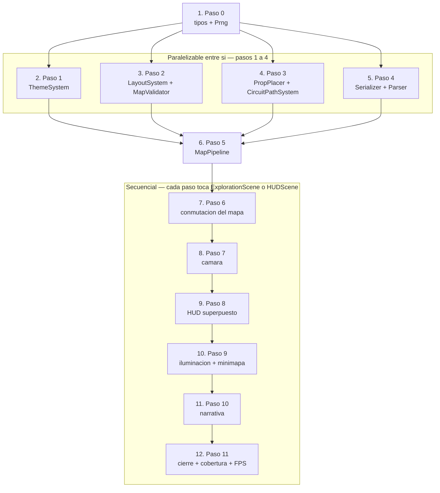
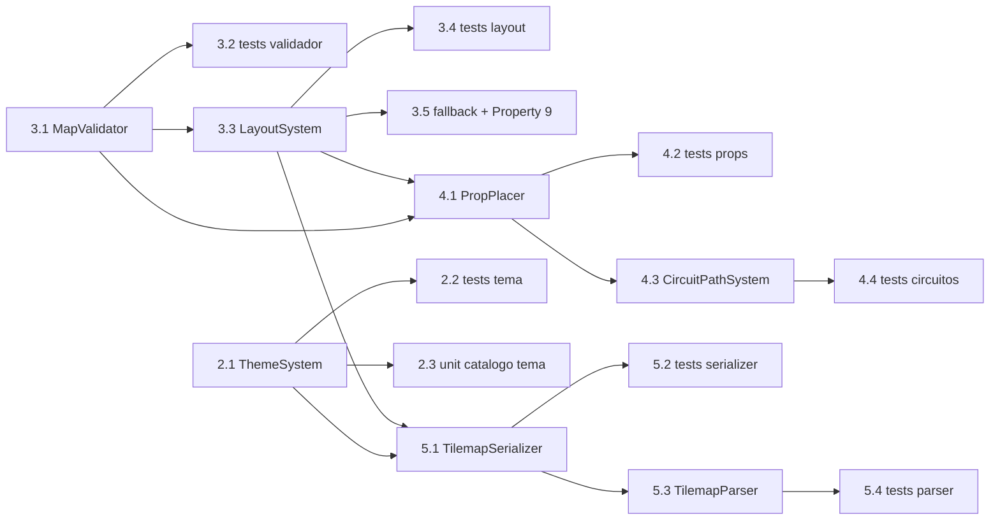

# Implementation Plan — Dungeon Visual Overhaul

## Overview

El plan sigue el orden de `## Migration and Rollout` del diseño (Paso 0 a Paso 11). Cada tarea de primer nivel corresponde a un paso del rollout y está construida para que, al terminarla, el juego siga jugable, `npx tsc --noEmit` compile con cero errores y `npx vitest --run` quede en verde.

Lenguaje de implementación: **TypeScript en modo estricto**, sin anotaciones `any`, con path alias `@/` (Requerimiento 13.7). Los módulos de `src/systems/` y `src/lib/` listados como puros no declaran ninguna importación de `phaser`.

Los pasos 1 a 4 del rollout (tareas 2 a 5) son independientes entre sí y paralelizables. El paso 5 (tarea 6) los une en `MapPipeline`. Del paso 6 al 11 (tareas 7 a 12) la ejecución es secuencial porque cada uno toca `ExplorationScene` o `HUDScene`.

### Dependencias revisadas y ajustes de orden

No se detectaron dependencias rotas en el orden del rollout. Se registran tres precisiones que el diseño deja implícitas y que este plan resuelve sin reordenar pasos:

1. **Propiedad 9** está asignada en la Testing Strategy a `MapValidator.test.ts`, pero su enunciado invoca `buildFloor`, que solo existe en el Paso 5. Se implementa en la tarea 3.5 sobre `generateFloor` (a quien el pipeline delega la generación y la validación) y se re-verifica sobre `buildFloor` en la tarea 6.2.
2. **`arbFloor`** de la sección de propiedades se define en términos de `buildFloor`. En las tareas 4 y 5, anteriores al pipeline, los tests componen el generador localmente (`generateFloor` → `placeProps` → `buildCircuitPaths`) con un helper de test; en la tarea 6.2 ese helper se reemplaza por `buildFloor`.
3. **Propiedad 50** se prueba en `src/entities/DialogBox.queue.test.ts` "sobre el módulo puro de cola", que el inventario no nombra. Se resuelve exportando la cola como función pura desde `src/entities/DialogBox.ts` (`createDialogQueue`), sin dependencia de Phaser, para que el test de la propiedad no instancie el contenedor.

---

## Tasks

- [ ] 1. Paso 0 — Tipos compartidos y PRNG determinista
  - [ ] 1.1 Extender `src/types/index.ts` con los tipos de geometría y validación del descriptor
    - Agregar `TileRef`, `RoomRole`, `Room`, `Corridor`, `ObjectiveType`, `Objective`, `PropType`, `Prop`, `CircuitPath`, `FloorDescriptor`, `Violation` y `ValidationResult` con las firmas exactas de la sección `## Data Models`
    - Documentar en el propio archivo el contrato de colisión: `0` = Tile_Caminable, cualquier valor distinto de `0` = Tile_Bloqueante, arreglo plano indexado por `row * width + column` y longitud `width * height`
    - No mover a este barrel los tipos de módulo único (`Theme`, `LightingParams`, `CameraFrame`, `HudRect`, `MinimapProjectionResult`)
    - _Requerimientos: 3.1, 13.7_

  - [ ] 1.2 Crear `src/lib/Prng.ts` con la interfaz `Prng` y `createPrng(seed)`
    - Implementar `next`, `intInRange` (rango cerrado, retorna `min` si `min > max`), `pick` (lanza `RangeError` con arreglo vacío), `shuffle` (Fisher-Yates sobre copia, sin mutar la entrada), `sample` y `fork(label)` con flujo derivado independiente
    - Usar la congruencia lineal del proyecto: `rng = (rng * 1664525 + 1013904223) & 0x7fffffff`
    - Cero llamadas a `Math.random` en todo el módulo
    - _Requerimientos: 2.9, 5.5, 6.5, 13.6, 13.7_

  - [ ] 1.3 Escribir `src/lib/Prng.test.ts` con property tests de determinismo y rangos
    - Propiedades a cubrir: dos `createPrng(seed)` con la misma semilla producen la misma secuencia; `intInRange(min, max)` siempre devuelve un entero en el rango cerrado; `shuffle` devuelve una permutación de la entrada y no la muta; `sample(items, count)` devuelve `min(count, items.length)` elementos distintos; `fork(label)` es determinista por etiqueta e independiente del flujo padre
    - Etiquetar cada test con `// Feature: dungeon-visual-overhaul, Property N: ...` según la convención de `.kiro/steering/tech.md`, mínimo 100 iteraciones (`{ numRuns: 100 }`)
    - Cobertura de líneas ≥ 90 % del archivo
    - _Requerimientos: 13.8, 13.9_

- [ ] 2. Paso 1 — Tema, paletas y contraste
  - [ ] 2.1 Crear `src/systems/ThemeSystem.ts` con las tres paletas y los índices de tile compartidos
    - Exportar `ThemeId`, `ThemePalette`, `ThemeTiles`, `ThemeTints`, `Theme`, `resolveTheme`, `getThemeIds`, `relativeLuminance`, `contrastRatio`, `hueSaturation`, `toThemeId` y `themeIdForDifficulty`
    - Cargar los valores exactos de la tabla de paletas de `## Theming` y los índices base compartidos (piso `79/80/81`, muro `1/27/53`, vacío `27` con `tintFill`, props según la tabla de props)
    - `resolveTheme` es total: entrada no reconocida devuelve el tema `normal` completo con `isFallback: true`; `levelNumber` fuera de `[1, 5]` se acota al límite más cercano; `circuitBaseAlpha` es 0.35 en `hard` y 0.75 en `beginner` y `normal`
    - No modificar `src/lib/Colors.ts`: `ThemeSystem` lo complementa para el mundo de juego y `COLORS` / `COLORS_HEX` siguen sirviendo a las escenas de menú
    - _Requerimientos: 1.1, 1.2, 1.6, 1.8, 1.9, 1.10, 1.11, 6.11, 12.4, 13.6_

  - [ ] 2.2 Escribir los property tests de `src/systems/ThemeSystem.test.ts`
    - _Propiedades: 27, 28, 29, 30, 31, 32, 33_
    - Property 27 calcula el ratio WCAG 2.1 sin redondeo previo y con la mayor luminancia relativa en el numerador
    - _Requerimientos: 1.2, 1.3, 1.4, 1.5, 1.6, 1.8, 1.9, 1.10, 1.11, 6.11, 9.5, 12.4, 12.7_

  - [ ] 2.3 Agregar los tests unitarios de catálogo del tema en el mismo archivo
    - Test de instantánea sobre `ThemeTiles.props` para fijar los índices re-purposados del tileset y que un cambio accidental falle en CI
    - Casos concretos de diferencia entre los tres pares de temas y de `toThemeId` con `''`, `null`, `undefined` y `'NORMAL'`
    - _Requerimientos: 1.11, 12.4_

- [ ] 3. Paso 2 — Layout y validación del descriptor
  - [ ] 3.1 Crear `src/systems/MapValidator.ts` con el BFS de alcanzabilidad y `validateFloor`
    - Exportar `VALIDATION_CHECKS`, `ValidationCheck`, `validateFloor`, `reachableFrom`, `allObjectivesReachable` y `violationsByCheck`
    - `reachableFrom` explora solo las cuatro direcciones cardinales; `validateFloor` corre un único BFS y consulta pertenencia por objetivo
    - Ejecutar todas las comprobaciones y devolver una entrada de violación por incumplimiento con `check`, `row` y `column`; las comprobaciones estructurales (`collision-length`, `dimensions`, `spawn-in-bounds`) cortan antes de las semánticas y nunca lanzan excepción
    - Reportar el tile de la puerta con `check: 'objective-walkable'` y `detail: 'door/boss-access'`, porque puerta de salida y acceso al jefe son el mismo tile
    - _Requerimientos: 3.2, 3.3, 3.4, 3.5, 3.6, 3.13, 3.14, 13.6_

  - [ ] 3.2 Escribir los property tests de `src/systems/MapValidator.test.ts`
    - _Propiedades: 10, 11_
    - Usar un `referenceBfs` independiente declarado en el archivo de test, no la implementación de producción
    - _Requerimientos: 3.6, 3.14_

  - [ ] 3.3 Crear `src/systems/LayoutSystem.ts` con los dos generadores, el bucle de reintentos y el descriptor de reserva
    - Exportar `LayoutRequest`, `LayoutOutcome`, `generateFloor`, `generateSingleRoomFloor`, `generateMultiRoomFloor`, `createFallbackFloor` y `terminalCountFor`
    - Implementar los algoritmos 1, 2 y 4 de `## Algorithms`, incluidos `elegirDispersos`, la grilla `2 × 3` de celdas `12 × 11`, los corredores en L de ancho 1 o 2 y el flujo derivado `prng.fork('objectives')` que garantiza la paridad topológica entre `normal` y `hard`
    - Perímetro nunca tallado; dificultad no reconocida resuelve como `normal`; nivel acotado a `[1, 5]`; hasta 10 intentos con `seed + intento` y caída a `createFallbackFloor` (sala 12 × 9 en mapa 14 × 11, sin props bloqueantes)
    - Consumir `getDifficultyConfig` de `src/systems/DifficultySystem.ts` y `getLevelDefinition` de `src/data/levels.ts` sin modificarlos
    - _Requerimientos: 2.1, 2.2, 2.3, 2.4, 2.5, 2.6, 2.7, 2.8, 2.9, 2.10, 2.11, 2.12, 2.13, 2.14, 3.7, 3.8, 3.15, 13.6_

  - [ ] 3.4 Escribir los property tests de `src/systems/LayoutSystem.test.ts`
    - _Propiedades: 1, 2, 3, 4, 5, 12, 13_
    - _Requerimientos: 2.1, 2.2, 2.3, 2.4, 2.5, 2.6, 2.7, 2.8, 2.9, 2.10, 2.12, 2.14, 3.7_

  - [ ] 3.5 Agregar los tests del descriptor de reserva y de validez del generador
    - Test unitario: `createFallbackFloor` produce sala caminable 12 × 9 en mapa 14 × 11, spawn `(2, 2)`, terminales `(2, 5)` y `(2, 8)`, puerta `(9, 11)`, `props = []`, y `validateFloor` devuelve `violations = []`
    - Property 9 en su versión sobre `generateFloor`: para toda dificultad, nivel y semilla, `validateFloor(outcome.floor)` es válido con lista de incumplimientos vacía. Se re-verifica sobre `buildFloor` en la tarea 6.2
    - _Propiedades: 9_
    - _Requerimientos: 3.8, 3.13_

  - [ ] 3.6 Checkpoint — Ensure all tests pass
    - Ejecutar `npx tsc --noEmit` y `npx vitest --run`. Verificar que ninguna prueba existente cambió de resultado. Preguntar al usuario si surgen dudas.

- [ ] 4. Paso 3 — Props de datacenter y trazas de circuito
  - [ ] 4.1 Crear `src/systems/PropPlacer.ts` con la colocación determinista de props
    - Exportar `PropPlacementRequest`, `PropPlacementResult`, `MAX_PROPS_PER_FLOOR`, `BLOCKING_PROP_TYPES`, `isBlockingProp` y `placeProps`
    - Implementar el algoritmo 5: densidad `N ∈ [floor(0.12·P), floor(0.25·P)]` por sala, tabla de pesos de `## Theming`, `server-rack` solo en tiles con vecino cardinal bloqueante del perímetro de la sala, `padlock` solo adyacente al tile de la puerta, exclusiones de spawn, objetivos, vecinos cardinales de objetivo, tiles de circuito, corredores y tiles ya ocupados
    - Escribir el índice de tile del prop en la copia del arreglo de colisión solo cuando es bloqueante, revertir a `0` y descartar el prop si `allObjectivesReachable` falla, y sustituir `energy-container` por `corrupt-container` cuando la dificultad es `hard`
    - Devolver también `propsLayer` (índice por tile, `0` donde no hay prop) y `discarded`; máximo un prop por tile y 40 props por descriptor
    - _Requerimientos: 3.9, 3.10, 5.1, 5.2, 5.3, 5.4, 5.5, 5.7, 5.9, 5.10, 5.11, 13.6_

  - [ ] 4.2 Escribir los property tests de `src/systems/PropPlacer.test.ts`
    - _Propiedades: 14, 15, 16, 17_
    - Componer el descriptor de entrada con `generateFloor` mediante un helper local de test, hasta que exista `buildFloor`
    - _Requerimientos: 3.1, 3.9, 3.10, 5.2, 5.3, 5.4, 5.5, 5.7, 5.9, 5.11_

  - [ ] 4.3 Crear `src/systems/CircuitPathSystem.ts` con el BFS de ruta mínima y la función de color de tile
    - Exportar `CircuitPathResult`, `buildCircuitPaths`, `shortestPath` y `maxCircuitLength`
    - `shortestPath` usa predecesores y orden de exploración fijo `[arriba, izquierda, derecha, abajo]`, lo que hace la ruta única y determinista para un descriptor dado
    - Un circuito por objetivo en el orden del descriptor; objetivo ubicado en el tile de spawn produce un circuito de exactamente un tile; objetivo inalcanzable omite su circuito, conserva los demás y agrega una violación con sus coordenadas
    - Exportar además la función pura de color de tile de circuito (`circuitTileColor`), que devuelve el acento primario si el tile pertenece a al menos un circuito con objetivo no activado y el secundario solo si todos sus circuitos conducen a objetivos activados
    - _Requerimientos: 6.1, 6.2, 6.3, 6.4, 6.5, 6.6, 6.7, 6.12, 13.6_

  - [ ] 4.4 Escribir los property tests de `src/systems/CircuitPathSystem.test.ts`
    - _Propiedades: 18, 19, 20, 21, 22_
    - Property 19 usa `referenceShortestLength`, una implementación de BFS de referencia independiente declarada en el propio archivo de test
    - _Requerimientos: 6.1, 6.2, 6.3, 6.4, 6.5, 6.6, 6.12_

- [ ] 5. Paso 4 — Serialización y parseo del formato Tiled
  - [ ] 5.1 Crear `src/systems/TilemapSerializer.ts` con el emisor de JSON Tiled
    - Exportar los tipos `TiledTileLayer`, `TiledObjectEntry`, `TiledObjectLayer`, `TiledTilesetRef`, `TiledMapJson`, `SerializeErrorCode`, `SerializeError`, `SerializeResult` y la función `serializeFloor`
    - Emitir las cuatro capas `ground`, `props`, `collision` y `objects`, con `width` y `height` del descriptor, exactamente `width × height` valores por capa de tiles, y el tileset `puny-dungeon` declarado con 26 columnas y tiles de 16 × 16
    - La capa `objects` declara el spawn, cada objetivo con tipo y coordenadas de tile, cada prop (`objectType = 'prop'`, `propType`, `blocking`) y cada circuito (`objectType = 'circuit'`, `objectiveId`, `tiles` como `"r,c;r,c;..."` en orden de recorrido)
    - Orden de claves y de objetos fijo y documentado en el archivo, porque de él depende la igualdad exacta del round-trip; los descriptores no serializables devuelven `{ ok: false, error }` y nunca ausencia de salida
    - Conservar la compatibilidad de la capa `objects` con `InteractableSystem.parseInteractables`, que no se modifica
    - _Requerimientos: 4.1, 4.2, 4.5, 4.8, 13.6_

  - [ ] 5.2 Escribir los property tests de `src/systems/TilemapSerializer.test.ts`
    - _Propiedades: 23, 24_
    - Agregar el test que verifica que la cantidad y las coordenadas de los objetivos del descriptor coinciden con los `Interactable` producidos por `parseInteractables` sobre la capa `objects`
    - _Requerimientos: 4.1, 4.2, 4.3, 4.4, 4.5, 4.8_

  - [ ] 5.3 Crear `src/systems/TilemapParser.ts` con el parseo tolerante y el error discriminado
    - Exportar `ParseErrorCode`, `ParseError`, `ParseResult` y `parseTiledMap`
    - Todo error es observable por el llamador y nombra cada capa o declaración ausente, sin sustituir lo ausente por valores por defecto, spawn de reserva ni colecciones vacías, y sin lanzar excepción
    - Única ausencia tolerada: la capa `props`, que produce `props = []` y `propsLayer` de ceros, con el resto de los campos derivado de las capas presentes
    - Conservar el valor `0` para cada Tile_Caminable según el contrato de colisión
    - _Requerimientos: 4.3, 4.6, 4.7, 4.9, 4.10, 4.11, 13.6_

  - [ ] 5.4 Escribir los property tests de `src/systems/TilemapParser.test.ts`
    - _Propiedades: 25, 26_
    - _Requerimientos: 4.6, 4.7, 4.9, 4.10, 4.11_

- [ ] 6. Paso 5 — Orquestador del pipeline de generación
  - [ ] 6.1 Crear `src/systems/MapPipeline.ts` con `buildFloor`
    - Exportar `FloorBuildRequest`, `FloorBuildResult` y `buildFloor`
    - Encadenar `resolveTheme` → `generateFloor` → `validateFloor` → `placeProps` → `buildCircuitPaths` → `validateFloor` (revalidación post-props) → `serializeFloor`, sin mutar entradas: cada etapa devuelve un descriptor nuevo
    - Devolver `floor`, `theme`, `validation`, `mapKey`, `json` (`null` si la serialización falló), `attempts`, `usedFallback`, `diagnostics` acumulados de toda la cadena y `elapsedMs`
    - Registrar en `diagnostics` las entradas `theme:fallback`, `layout:fallback {seed}` y `serialize:failed {code}`
    - _Requerimientos: 3.7, 3.8, 3.12, 4.5, 13.6, 13.12_

  - [ ] 6.2 Escribir los property tests de `src/systems/MapPipeline.test.ts`
    - _Propiedades: 6, 7, 8, 55_
    - Property 8 usa `referenceBfs` independiente; Property 55 mide el presupuesto de 500 ms de la cadena completa sin Phaser
    - Re-verificar Property 9 sobre `buildFloor` y sustituir el helper local de las tareas 4.2 y 5.2 por `arbFloor` definido con `buildFloor`
    - _Requerimientos: 2.11, 2.13, 3.2, 3.3, 3.4, 3.5, 3.13, 3.15, 5.6, 5.10, 13.12_

  - [ ] 6.3 Checkpoint — Ensure all tests pass
    - Ejecutar `npx tsc --noEmit` y `npx vitest --run`. Los catorce módulos puros existen y están testeados, y `ExplorationScene` sigue funcionando con el generador viejo. Preguntar al usuario si surgen dudas.

- [ ] 7. Paso 6 — Conmutación del mapa en `ExplorationScene`
  - [ ] 7.1 Extender `src/lib/SpriteGenerator.ts` con las texturas de reserva por tema
    - Agregar `generateThemeFallbackTextures(scene, theme)` y `fallbackPropTextureKey(type, themeId)`, conservando `generateAllSprites` sin cambios
    - Producir por tema 10 texturas de 16 × 16 px dibujadas con Canvas 2D y los colores exactos de la paleta: piso, muro, vacío y los siete tipos de prop, con las claves `fb-floor-{themeId}`, `fb-wall-{themeId}`, `fb-empty-{themeId}` y `fb-prop-{propType}-{themeId}`
    - Incluir en `fb-prop-crt-monitor-*` las tres filas de 1 px en `accentPrimary` a opacidades 1.0 / 0.7 / 0.4 declaradas en `## Visual Fidelity Limitations`
    - Agregar tests unitarios de las claves generadas y del cumplimiento de los ratios piso/muro ≥ 3.0 y piso/vacío ≥ 4.5 sobre los colores de la paleta
    - _Requerimientos: 12.1, 12.2, 12.6, 12.7_

  - [ ] 7.2 Reescribir `create()` de `src/scenes/ExplorationScene.ts` sobre `buildFloor`
    - Reemplazar `generateProceduralMap` por `buildFloor`, tomar `collisionData` directamente de `built.floor.collision` sin recalcular ni reescribir, y colocar al héroe en `floor.spawn` en lugar del tile fijo `(3, 3)`
    - Construir las capas del tilemap con `registerProceduralMap` cuando `built.json` existe, y con `renderFallbackTextures()` cuando la textura `tiles-puny-dungeon` no está en la caché, dentro del mismo ciclo de creación y sin exceder 2000 ms
    - Aplicar los tintes del tema con `tile.tint` en piso y muro y `tile.tintFill` en vacío, sobre las capas `ground`, `collision` y `props`, sin `Graphics` del tamaño del mapa y sin tocar la interfaz
    - Renderizar la capa de colisión con opacidad 1.0, dibujar circuitos (`depth 2`, trazo de 2–4 px, pulso de 1.0–2.0 s, opacidad base del tema), halos de objetivo (`depth 6`) y sprites de prop (`depth 4`), con el héroe en `depth 10`
    - Recolorear el circuito y retirar el halo del objetivo dentro de 500 ms de su activación, usando `circuitTileColor` para los tiles compartidos
    - Registrar `this.events.once('shutdown', () => this.releaseVisuals())`, que destruye los `Graphics`, los tweens de pulso y los temporizadores creados
    - Conservar textualmente `initInteractables`, `handleInteraction`, `openPuzzle` con sus tres listeners de `EventBus`, `handleDoor`, `checkCompletion`, `transitionToBoss`, `onDefeat`, `tryAutoSave` y `updateHUD`
    - _Requerimientos: 1.7, 3.11, 3.12, 5.8, 6.8, 6.9, 6.10, 6.11, 6.12, 7.2, 7.3, 12.3, 12.8, 13.3, 13.4, 13.10, 13.11_

  - [ ] 7.3 Eliminar el generador viejo y los métodos obsoletos de la escena
    - Quitar `generateProceduralMap` y la constante `TILES` de `src/lib/ProceduralMap.ts`, junto con el bloque inline de JSON Tiled, conservando `registerProceduralMap` con la firma intacta
    - Quitar de `src/scenes/ExplorationScene.ts` los métodos `generateDecoration`, `getScenarioPalette` y `extractCollisionData`, y la llamada `collisionLayer.setAlpha(0.5)`
    - Quitar de `ExplorationScene.preload` la precarga de `mapPath` y `tilesetPath` legados, conservando `MAP_CONFIGS` de `MapLoader` sin cambios porque sus tests lo verifican
    - _Requerimientos: 1.7, 3.12, 13.5_

  - [ ] 7.4 Escribir los tests de escena del mapa en jsdom, sin `Phaser.Game`
    - Instanciar la escena con dobles de prueba para `add.graphics`, `add.image`, `add.text`, `textures.exists`, `cameras.main`, `tweens.add` y `time.delayedCall`
    - Verificar: capa de colisión con `alpha === 1` y los índices del tema; profundidades relativas de circuitos, props y héroe; tinte aplicado a capas de mundo y no a la interfaz; ruta de texturas de reserva cuando `textures.exists` es falso; héroe ubicado en `floor.spawn`; movimiento bloqueado ante tile con colisión distinta de `0` y ante coordenada fuera de límites; conteo de `Graphics` persistentes ≤ 6; las cuatro transiciones de escena; descriptor conservado al volver de `PuzzleScene`; liberación en `shutdown`
    - _Requerimientos: 1.7, 3.11, 3.12, 5.8, 6.8, 12.3, 13.3, 13.4, 13.10, 13.11_

  - [ ] 7.5 Checkpoint — Ensure all tests pass
    - Ejecutar `npx tsc --noEmit` y `npx vitest --run`, y confirmar que el juego arranca y es jugable con el mapa nuevo. Preguntar al usuario si surgen dudas.

- [ ] 8. Paso 7 — Encuadre de cámara
  - [ ] 8.1 Crear `src/systems/CameraFraming.ts` con el cálculo puro de encuadre
    - Exportar `CameraRect`, `CameraFrame`, las constantes `VIEWPORT_WIDTH`, `VIEWPORT_HEIGHT`, `TILE_SIZE`, `BOUNDS_PADDING_PX`, `FALLBACK_ZOOM` y `FOLLOW_LERP`, y la función `computeCameraFrame`
    - Zoom 3.0 en `beginner` y `redondear2(clamp(960 / (ancho × 16), 1.5, 2.5))` en el resto; viewport 960 × 540 con origen `(0, 0)`; límites `ancho × 16 + 32` por `alto × 16 + 32` con origen `(−16, −16)`; `followLerp` 0.10; `centerX` y `centerY` activos en los ejes donde el mapa renderizado no supera el viewport
    - Entradas inválidas o dificultad no reconocida devuelven zoom de reserva 2.5, viewport preservado e `isFallback: true`, sin lanzar
    - _Requerimientos: 11.1, 11.2, 11.3, 11.4, 11.5, 11.6, 11.7, 11.8, 13.6_

  - [ ] 8.2 Escribir los property tests de `src/systems/CameraFraming.test.ts`
    - _Propiedades: 37, 38_
    - _Requerimientos: 11.1, 11.2, 11.3, 11.4, 11.5, 11.6, 11.7, 11.8_

  - [ ] 8.3 Crear `src/entities/CameraController.ts` y conectarlo en `ExplorationScene`
    - Implementar `apply`, `follow` y `reframe`: fijar zoom, viewport y límites, aplicar `camera.centerOn` en los ejes con bandera de centrado y `startFollow(hero, true, 0.10, 0.10)` en el resto
    - Reemplazar en `ExplorationScene.create` el bloque `setViewport(0, 0, 780, 540)` + `setZoom(2.5)` por `computeCameraFrame` + `CameraController`, y llamar a `reframe` al cambiar de piso antes de renderizar el primer fotograma
    - _Requerimientos: 11.1, 11.2, 11.3, 11.4, 11.5, 11.7, 11.8, 11.9, 13.1_

  - [ ] 8.4 Agregar los tests de escena del `CameraController`
    - Con el doble de `cameras.main`, verificar que se fijan viewport 960 × 540, zoom y límites con el relleno de 16 px por lado, que el seguimiento usa lerp 0.10 y que `reframe` recalcula al cambiar de piso
    - _Requerimientos: 11.3, 11.4, 11.5, 11.9_

- [ ] 9. Paso 8 — HUD superpuesto estilo terminal
  - [ ] 9.1 Crear `src/systems/HudLayout.ts` con la geometría y los formatos puros del HUD
    - Exportar `HudRect`, `hpSegments`, `hpText`, `objectiveCounterText`, `intersects`, `hudBlocksFor` y `HUD_FORBIDDEN_REGION`
    - `hpSegments` implementa `clamp(ceil(hp / 25), 0, 4)`; `hudBlocksFor` devuelve los bloques `status`, `score`, `controls` y `topBand` según la dificultad, omitiendo `controls` en `hard` e incluyendo `topBand` en `normal` y `hard`
    - Incluir el reductor puro de estado del HUD que distingue "sin datos aún" de "datos recibidos", para que la propiedad 48 no dependa de Phaser
    - `HUD_FORBIDDEN_REGION = { x: 240, y: 135, width: 480, height: 270 }`
    - _Requerimientos: 8.2, 8.3, 8.4, 8.5, 8.6, 8.10, 8.12, 8.13, 8.14, 8.15, 13.6_

  - [ ] 9.2 Escribir los property tests de `src/systems/HudLayout.test.ts`
    - _Propiedades: 44, 45, 46, 47, 48_
    - Property 47 compone `uiBackground` sobre el color de piso del tema con opacidad en `[0.45, 0.75]` antes de calcular el ratio
    - _Requerimientos: 8.2, 8.3, 8.4, 8.5, 8.6, 8.10, 8.11, 8.12, 8.13, 8.14, 8.15_

  - [ ] 9.3 Agregar a `src/data/translations.ts` las claves nuevas del HUD en `en` y `es`
    - Claves de etiqueta de HP, contador de objetivos, score, nombre de dificultad e indicadores de controles, con valores de 1 a 240 caracteres y el mismo conjunto de placeholders `{param}` en ambas localizaciones
    - _Requerimientos: 8.7, 14.1, 14.2, 14.5_

  - [ ] 9.4 Reescribir `src/scenes/HUDScene.ts` como bloques superpuestos
    - Definir `HUD_BLOCKS` con `status { 8, 8, 292, 68 }`, `score { 660, 8, 292, 52 }`, `controls { 660, 468, 292, 64 }` y `topBand { 330, 8, 300, 28 }`, creando todos los objetos con `setScrollFactor(0)` y `setDepth(1000)`
    - Eliminar `PANEL_WIDTH`, `PANEL_X`, `createPanelBackground` y `addSeparator`
    - Suscribir los eventos nuevos `hud:updateHP`, `hud:updateObjectives` y `hud:updateTheme` conservando los legados, y mantener el estado interno del reductor de `HudLayout`
    - Fondos de bloque con opacidad en `[0.45, 0.75]`, todas las cadenas vía `t()`, y refresco de textos al cambiar la localización dentro de 500 ms preservando los valores numéricos de HP, objetivos y score
    - Emitir desde `ExplorationScene.updateHUD` los tres eventos nuevos junto a los legados
    - _Requerimientos: 8.1, 8.5, 8.6, 8.7, 8.8, 8.9, 8.10, 8.11, 8.12, 8.13, 8.14, 8.15, 14.2, 14.3, 14.8_

  - [ ] 9.5 Ampliar `src/scenes/HUDScene.test.ts` con los casos del HUD superpuesto
    - Conservar sin modificar los asserts existentes de aritmética de corazones y fragmentos
    - Agregar: `scrollFactor 0` y profundidad de todos los objetos creados; correspondencia entre `hudBlocksFor` y los objetos efectivamente creados por dificultad; ausencia de dibujo en la región prohibida; cadenas obtenidas vía `t()`; refresco de localización sin alterar los valores numéricos; HUD visible con 0 segmentos y texto `0/100` cuando el HP es 0
    - _Requerimientos: 8.1, 8.7, 8.8, 8.9, 8.14, 8.15, 13.5, 14.2_

  - [ ] 9.6 Checkpoint — Ensure all tests pass
    - Ejecutar `npx tsc --noEmit` y `npx vitest --run`. La ventana de fealdad del paso anterior queda cerrada: viewport completo con HUD superpuesto. Preguntar al usuario si surgen dudas.

- [ ] 10. Paso 9 — Iluminación y minimapa
  - [ ] 10.1 Crear `src/systems/LightingSystem.ts` y sus property tests
    - Exportar `LightingParams`, `resolveLighting` y `clampLighting`
    - Rangos: `tintAlpha` en `[0.03, 0.12]`, `vignetteIntensity` en `[0.25, 0.35]` para `hard` y en `[0.10, 0.20]` para `beginner` y `normal`, `haloRadius` 12–24, `haloMaxAlpha` 0.40–0.80, `haloPeriodMs` 1000–2000
    - Ante cualquier argumento no reconocido, devolver la combinación tema `normal` + dificultad `normal` para ambos parámetros, descartando el argumento reconocido, sin propagar error
    - Escribir `src/systems/LightingSystem.test.ts`
    - _Propiedades: 34, 35, 36_
    - _Requerimientos: 7.1, 7.2, 7.5, 7.6, 7.7, 7.8, 7.10, 13.6_

  - [ ] 10.2 Crear `src/systems/MinimapProjection.ts` y sus property tests
    - Exportar `MinimapProjectionInput`, `MinimapCellKind`, `MinimapCell`, `MinimapProjectionResult`, `MINIMAP_MAX_PX`, `MINIMAP_MARGIN_PX`, `DISCOVERY_RADIUS`, `computeMinimapScale`, `projectMinimap`, `discoveredAround` y `selectActiveObjective`
    - Escala `max(1, floor(120 / max(ancho, alto)))`, origen `(8, 540 − 8 − heightPx)`, recorte a 120 px por lado, celdas solo de tiles descubiertos, y proyección vacía sin excepción cuando alguna dimensión queda fuera de `[1, 40]`
    - `selectActiveObjective` minimiza lexicográficamente Manhattan, fila y columna sobre objetivos no activados y descubiertos, y devuelve `null` si no hay ninguno
    - Escribir `src/systems/MinimapProjection.test.ts` con `referenceChebyshev` independiente para la propiedad de descubrimiento
    - _Propiedades: 39, 40, 41, 42, 43_
    - _Requerimientos: 9.1, 9.3, 9.4, 9.7, 9.8, 9.9, 9.11, 9.12, 13.6_

  - [ ] 10.3 Crear `src/entities/MinimapRenderer.ts`, reescribir la iluminación de la escena y eliminar los métodos obsoletos
    - Implementar `MinimapRendererConfig`, `update(heroTile, objectives)` y `destroy()`, con `setScrollFactor(0)`, `revealAll` en `beginner`, caminable en `palette.floor`, bloqueante en `palette.wall`, héroe en `accentPrimary` y objetivo activo en `accentSecondary`
    - Reemplazar la iluminación de `ExplorationScene` por `resolveLighting` + `clampLighting`: viñeta de 960 × 540 con `setScrollFactor(0)` y opacidad acotada, tinte ambiental aplicado como `tile.tint` y `setTint` sobre piso, muro y props, excluyendo HUD, DialogBox y minimapa; halos por objetivo con radio, opacidad y período del sistema
    - Eliminar `createLighting`, `createMinimap` y `updateMinimap` de `src/scenes/ExplorationScene.ts`
    - _Requerimientos: 7.2, 7.3, 7.4, 7.9, 7.10, 9.1, 9.2, 9.3, 9.4, 9.5, 9.6, 9.7, 9.10, 9.11, 9.12, 13.3, 13.11_

  - [ ] 10.4 Agregar los tests de escena de iluminación y minimapa
    - Verificar `scrollFactor 0` en viñeta y minimapa, tinte aplicado a capas de mundo y no a la interfaz, halo retirado dentro de 500 ms al activar un objetivo, minimapa sin celdas ante proyección vacía conservando el resto de la interfaz, y presupuesto de `Graphics` persistentes ≤ 6 tras agregar viñeta y minimapa
    - _Requerimientos: 7.3, 7.4, 7.9, 9.2, 9.12, 13.3_

- [ ] 11. Paso 10 — Narrativa en caja de diálogo
  - [ ] 11.1 Crear `src/lib/TextPager.ts` con `paginate` y su property test
    - Páginas de a lo sumo 4 líneas de a lo sumo 60 caracteres, preservando la secuencia de palabras del texto original sin pérdidas ni duplicados
    - Escribir `src/lib/TextPager.test.ts`
    - _Propiedades: 49_
    - _Requerimientos: 10.1, 13.6_

  - [ ] 11.2 Extraer la cola de mensajes como módulo puro y testearla
    - Exportar desde `src/entities/DialogBox.ts` la función pura `createDialogQueue({ queueLimit })`, sin dependencia de Phaser, que conserva el orden de llegada, retiene a lo sumo 5 mensajes pendientes, descarta solo los excedentes, nunca descarta el mensaje en curso y consume en cada avance la siguiente página o el siguiente mensaje pendiente
    - Escribir `src/entities/DialogBox.queue.test.ts` sobre esa función
    - _Propiedades: 50_
    - _Requerimientos: 10.8, 10.12_

  - [ ] 11.3 Crear el componente `src/entities/DialogBox.ts` sobre Phaser
    - Contenedor fijo al viewport (`setScrollFactor(0)`, `depth 120`), ancho 88 % y alto 24 % del viewport, centrado horizontalmente, borde inferior a 16 px, prompt `> ` al inicio de la primera línea
    - Escritura progresiva a 40 caracteres por segundo (rango admitido 20–60, desviación ≤ ±10 %); el avance con Espacio, Enter o clic completa la página en ≤ 100 ms, pasa a la siguiente página o mensaje, u oculta la caja cuando no queda nada pendiente
    - Indicador de continuar intermitente con período 1.0 s; `refreshLocale(text)` re-renderiza sin reiniciar el tipeo en curso; `applyTheme` y `destroy` liberan tweens y temporizadores
    - _Requerimientos: 10.1, 10.3, 10.4, 10.5, 10.11, 10.12, 13.11_

  - [ ] 11.4 Agregar las claves de diálogo y de reserva narrativa, y cerrar la paridad de traducciones
    - Extender `src/data/translations.ts` en `en` y `es` con las claves del DialogBox y el texto de reserva por nivel (`story.fallback.level`)
    - Crear `src/data/translations.test.ts` con la propiedad de paridad de claves, longitud de valor entre 1 y 240 caracteres y conjunto idéntico de placeholders
    - Ampliar `src/lib/i18n.test.ts` con las propiedades de clave inexistente y de sustitución parcial de placeholders, sin modificar sus tests existentes
    - _Propiedades: 51, 52, 53_
    - _Requerimientos: 14.1, 14.4, 14.5, 14.6, 14.7_

  - [ ] 11.5 Conectar el DialogBox en `ExplorationScene`
    - Mostrar la intro del nivel desde `getIntroStory` dentro de 500 ms del inicio, con la variante etiquetada `hard` de hasta 400 caracteres cuando exista, cayendo a la variante estándar si no existe y al texto de reserva vía `t()` si `StorySystem` no retorna nada
    - Encolar el mensaje de progreso al activar cada objetivo; mientras la caja está visible, bloquear movimiento e interacción dejando habilitadas solo pausa y avance; al ocultarse, restablecer el control en el mismo fotograma y consumir la pulsación de cierre
    - Agregar los tests de escena de bloqueo y restitución del control, intro mostrada al iniciar el nivel y texto de reserva ante `StorySystem` vacío
    - _Requerimientos: 10.2, 10.6, 10.7, 10.8, 10.9, 10.10, 10.13, 14.2_

  - [ ] 11.6 Checkpoint — Ensure all tests pass
    - Ejecutar `npx tsc --noEmit` y `npx vitest --run`. La feature está funcionalmente completa. Preguntar al usuario si surgen dudas.

- [ ] 12. Paso 11 — Cierre, cobertura y verificación manual
  - [ ] 12.1 Retirar los eventos legados del contrato de HUD
    - Eliminar la emisión de `hud:updateHearts` y `hud:updateFragments` en `src/scenes/ExplorationScene.ts` y sus listeners en `src/scenes/HUDScene.ts`, tras confirmar por búsqueda que ningún otro consumidor los escucha
    - Conservar `hud:updateScore`, `hud:updateLevel`, `hud:updateMode` y `hud:saved`
    - Ajustar en `src/scenes/HUDScene.test.ts` únicamente los asserts que dependían de los dos eventos retirados
    - _Requerimientos: 8.9, 13.5_

  - [ ] 12.2 Crear `src/systems/pure-modules.test.ts` con el test de independencia de Phaser
    - Leer con `fs` el texto fuente de `ThemeSystem`, `LayoutSystem`, `PropPlacer`, `CircuitPathSystem`, `MapValidator`, `LightingSystem`, `TilemapSerializer`, `TilemapParser`, `MinimapProjection`, `CameraFraming`, `HudLayout`, `MapPipeline`, `Prng` y `TextPager`, y afirmar que ninguno declara una importación del módulo `phaser`
    - Verificar además que la suite de esos módulos corre en jsdom sin instanciar `Phaser.Game`
    - _Propiedades: 54_
    - _Requerimientos: 13.6_

  - [ ] 12.3 Ajustar `vitest.config.ts` para cobertura por archivo con umbral del 90 %
    - Agregar `coverage: { provider: 'v8', include: ['src/systems/**', 'src/lib/**'], thresholds: { perFile: true, lines: 90 } }`, conservando `environment: 'jsdom'`, `globals: true`, `include: ['src/**/*.test.ts']` y el alias `@`
    - Ejecutar la suite con cobertura y completar los tests faltantes hasta que cada módulo puro nuevo alcance el umbral, sin agregación entre módulos
    - _Requerimientos: 13.8, 13.9_

  - [ ] 12.4 [MANUAL — no automatizable] Medir el promedio de FPS de `ExplorationScene`
    - Tarea de verificación manual: no puede ejecutarla un agente de código. Requiere un navegador de escritorio con aceleración por hardware; jsdom no permite medirla
    - Procedimiento: abrir el juego en el navegador, entrar a `ExplorationScene` con el Descriptor_De_Planta de mayor superficie en tiles que produce el `LayoutSystem` (`normal` o `hard`, 26 × 35), jugar una sesión continua de 30 segundos o más y registrar el promedio de FPS en cada ventana móvil de 60 fotogramas consecutivos
    - Criterio: promedio ≥ 50 FPS en toda ventana móvil. Anotar el resultado observado (navegador y versión, descriptor medido, promedio y mínimo) al cerrar esta tarea
    - _Requerimientos: 13.2_

  - [ ] 12.5 Checkpoint final — Ensure all tests pass
    - Ejecutar `npx tsc --noEmit` con cero errores y `npx vitest --run` con cero pruebas fallidas, verificar que las cuatro transiciones de escena siguen funcionando y que la resolución lógica 960 × 540 en modo FIT se conserva. Preguntar al usuario si surgen dudas.

---

## Notes

- Ninguna subtarea de test está marcada como opcional: los Requerimientos 13.8 y 13.9 exigen cobertura de líneas ≥ 90 % por módulo puro y property tests con mínimo 100 iteraciones, y el diseño asigna cada una de las 55 propiedades a un archivo concreto. Saltarlas dejaría requerimientos sin cumplir.
- Cada property test lleva el comentario `// Feature: dungeon-visual-overhaul, Property N: ...` y se ejecuta con `fc.assert(..., { numRuns: 100 })`. Una propiedad, un test.
- Las propiedades de alcanzabilidad, longitud mínima de ruta y descubrimiento usan implementaciones de referencia declaradas en el propio archivo de test (`referenceBfs`, `referenceShortestLength`, `referenceChebyshev`). Verificar el BFS de producción contra sí mismo no prueba nada.
- Los tests de escena corren en jsdom con dobles de prueba para `Tilemap`, `TilemapLayer`, `Graphics`, `tweens` y `time`. Nunca se instancia `Phaser.Game`.
- Tests existentes que se conservan sin modificación: `src/systems/MapLoader.test.ts`, `src/lib/TilemapHelper.test.ts`, `src/systems/MovementSystem.test.ts`. No existe `src/lib/ProceduralMap.test.ts`, por lo que la excepción del Requerimiento 13.5 no elimina ningún archivo.
- El presupuesto de `Graphics` persistentes es 6: circuitos, halos, viñeta, minimapa y marco del DialogBox ocupan cinco; queda uno libre. Los efectos de `FeedbackSystem` son transitorios y se destruyen en su `onComplete`.
- Las fórmulas de negocio de `.kiro/steering/tech.md` (daño, score, HP, escalado de bugs, apilamiento de ítems) no se tocan en ninguna tarea.

---

## Task Dependency Graph

Paralelismo a nivel de subtarea dentro de las tareas 2 a 5:

Notas de ejecución del grafo:

- `4.1 PropPlacer` depende de `3.1 MapValidator` (usa `allObjectivesReachable`) y de un descriptor de `3.3 LayoutSystem`. Dentro de la tarea 4, `PropPlacer` precede a `CircuitPathSystem`, que traza sobre el arreglo de colisión final.
- `5.1 TilemapSerializer` depende de `2.1 ThemeSystem` para los índices de tile y de `3.3 LayoutSystem` para el descriptor de entrada.
- Las tareas 7 a 12 escriben todas sobre `src/scenes/ExplorationScene.ts` o `src/scenes/HUDScene.ts`, por lo que no pueden ejecutarse en paralelo entre sí.
- Las tareas 2.1, 3.1 y 3.3 se pueden arrancar en paralelo apenas termina la tarea 1.

---

## Seguimiento fuera de alcance

- **Viewport de `PuzzleScene` fijado en 780 px.** `PuzzleScene` fija su cámara con `setViewport(0, 0, 780, 540)` porque el HUD actual reserva 180 px a la derecha. Con el HUD superpuesto de esta feature, ese recorte deja una banda muerta a la derecha del overlay de puzzle. El ajuste es de una línea (780 → 960), pero **no** se incluye en el plan: ningún criterio de aceptación de este spec lo cubre y `PuzzleScene` está declarada fuera del alcance en la sección `### Fuera de alcance` de `requirements.md`. Requiere decisión explícita del usuario antes de tocarlo; si la aprueba, entra como spec de seguimiento o como tarea nueva con su criterio de aceptación correspondiente.
