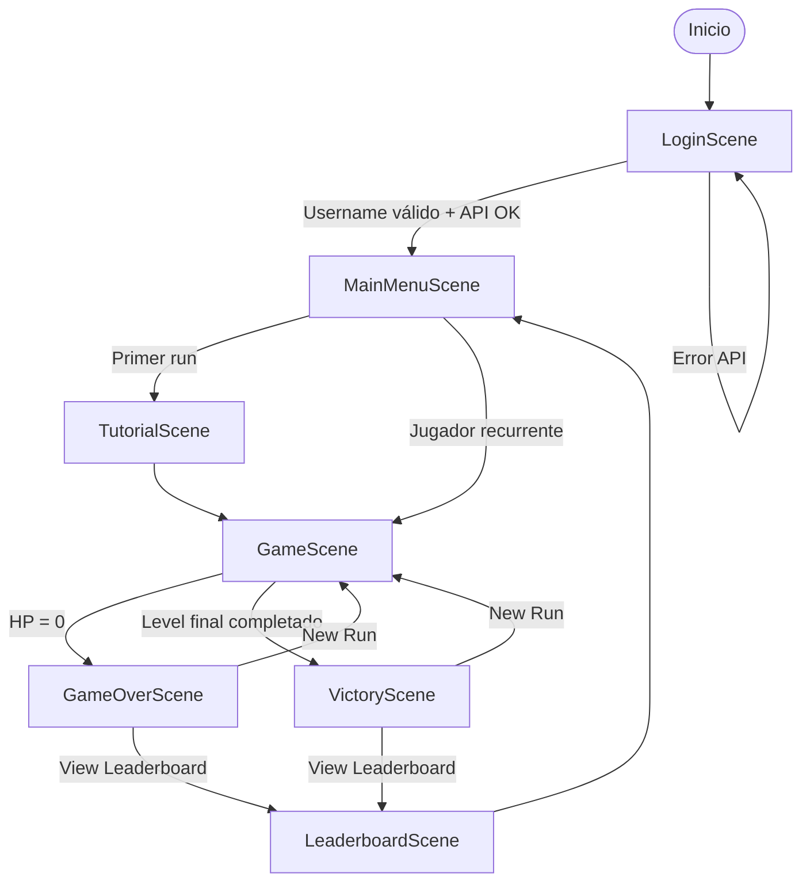
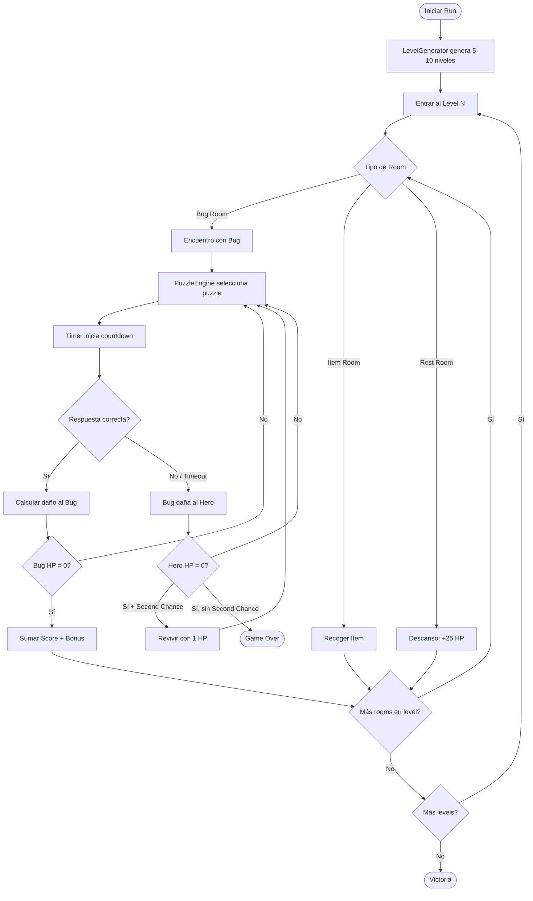
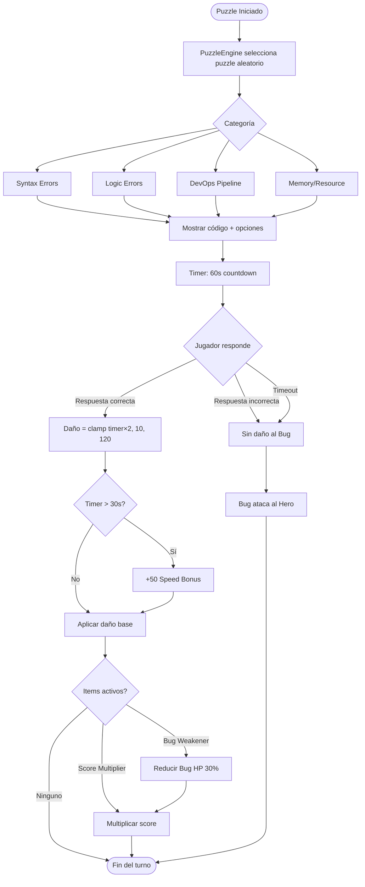
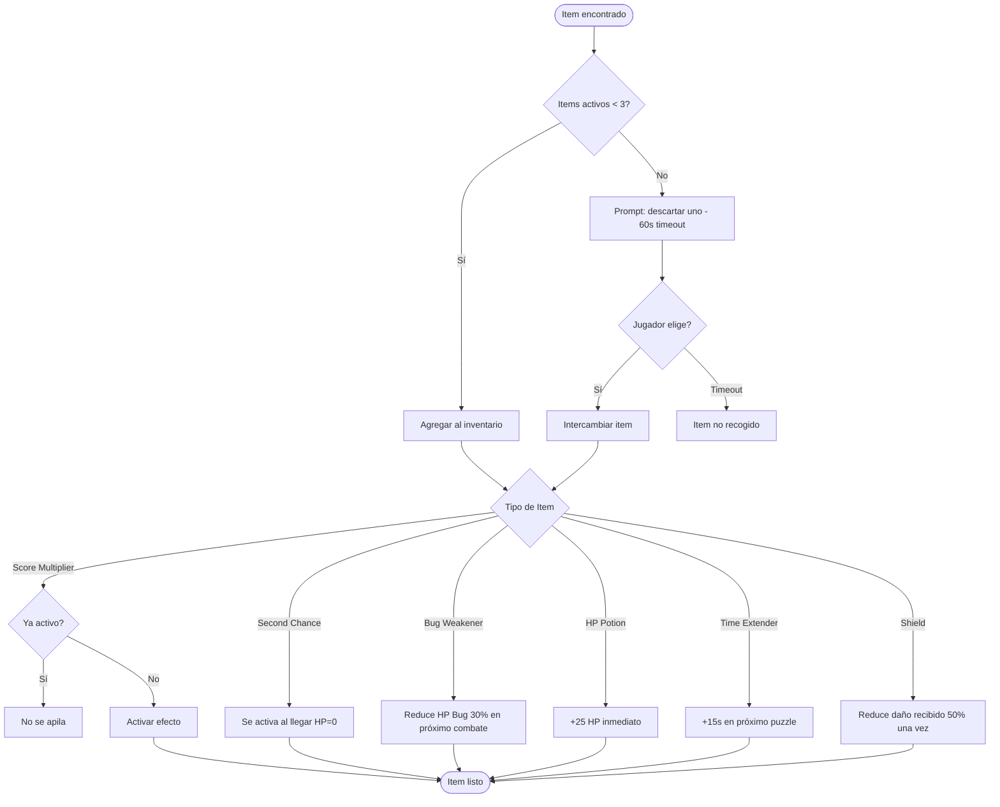
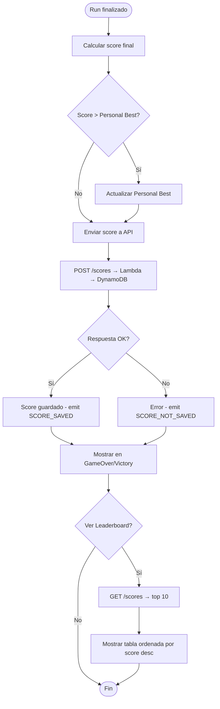

# Cloud Quest: DevOps Dungeon — Diagrama de Flujo del Juego

## Flujo General de Escenas

## Flujo de un Run (partida completa)

## Flujo de Resolución de Puzzle

## Flujo del Sistema de Items

## Flujo de Score y Leaderboard

